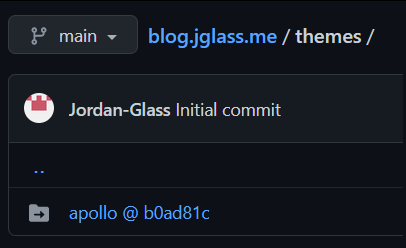
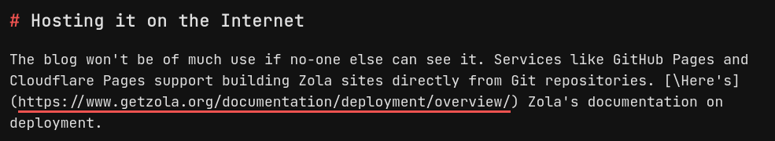

+++

title = "Getting Started with Zola, and How I Made This Blog"

date = 2023-01-27T11:47:00Z

+++

Zola is a Static Site Generator (SSG) that converts text you write in Markdown documents into a website that can be served on the Internet. Being a static site, it's simpler and doesn't require a database behind it to serve files from - and, in using Markdown, text is formatted in the same way as note-taking apps such as Notion and Obsidian, meaning you don't need to learn HTML syntax to start writing.

*In theory* that's simple, but figuring out how to make Zola build a nice-looking, themed site from those Markdown files could take a little more understanding. You might also want to use Git to track the changes you make, and publish the site automatically using a platform like GitHub or Cloudflare Pages.

In this post I'll share how I made this blog, from installing Zola, to adding a theme, and building a site you can see in your browser - as well as learning the basics of Git in the process.

<!-- more -->

*The installation and workspace initialisation steps below were carried out in Zola version 0.15.3, while the rest were done in the current 0.16.1 - but they shouldn't have changed since then.*

*You can find guides for using Markdown across the Internet - [here's one](https://github.com/marktext/marktext/blob/master/docs/MARKDOWN_SYNTAX.md) by another note-taking app, MarkText, and [here's another](https://github.com/adam-p/markdown-here/wiki/Markdown-Cheatsheet) for a browser extension called Markdown Here. You can visit the Zola website [here](https://www.getzola.org/) to find out more about how it works and what it does.*

# Installing Zola

How you install Zola depends on where you want to install it - there are [lots of different options](https://www.getzola.org/documentation/getting-started/installation/) for Linux distributions as well as Windows, macOS and Docker. There's no specific version for Ubuntu - or, therefore, Pop!\_OS - so I chose to install Zola as a Snap package. The Snap Store provides [nice, simple instructions](https://snapcraft.io/zola) for installing it on all the key distributions.

I updated my system using the Pop!\_Shop and rebooted, then installed Snap using

```
sudo apt install snapd
```

Then, after logging out and in again, I installed Zola using

```
sudo snap install zola --edge
```

*(If you also install using Snap, you might have to omit the `--edge` flag when Zola reaches Version 1 - check the [installation instructions](https://www.getzola.org/documentation/getting-started/installation/) for the right command to use.)*

In my case it spent a while setting up "security profiles", but sped through the rest of the steps relatively quickly. Back at the command prompt, the `zola` command shows that it's been installed successfully.

```
zola 0.15.3
Vincent Prouillet <hello@vincentprouillet.com>
A fast static site generator with everything built-in

USAGE:
    zola [OPTIONS] <SUBCOMMAND>

FLAGS:
    -h, --help       Prints help information
    -V, --version    Prints version information

OPTIONS:
    -c, --config <config>    Path to a config file other than config.toml in the root of project
    -r, --root <root>        Directory to use as root of project [default: .]

SUBCOMMANDS:
    build    Deletes the output directory if there is one and builds the site
    check    Try building the project without rendering it. Checks links
    help     Prints this message or the help of the given subcommand(s)
    init     Create a new Zola project
    serve    Serve the site. Rebuild and reload on change automatically
```

Now, let's configure Zola.

# Initialising a workspace

A Zola project directory stores a site's blog posts, theme, and all the other files Zola needs to work. Later, this folder can be sent to a Git repository from which it can be built and hosted online.

First, I made a directory dedicated to Zola with `mkdir` (make directory) and moved into it with `cd` (change directory):

1. `mkdir Zola`
2. `cd Zola`

Inside it, I created a directory to be used to hold all the files associated with this specific site. I chose to nest this folder inside a dedicated Zola one in case I make any more Zola sites in the future.

1. `mkdir blog`
2. `cd blog`

*(You can do these steps in a graphical file manager, of course, but I was already in the terminal after installing Zola.)*

Now I have a folder for my site, I can prompt Zola to "initialise" it and add all the folders and files it needs automatically using `zola init`. It'll ask a few basic questions about the site. If you don't know what to choose yet, press Enter to accept the default options - they can all be changed later.

*(For the yes/no options, the default is captialised: for example, the default setting for Sass compilation is No.)*

```
Welcome to Zola!
Please answer a few questions to get started quickly.
Any choices made can be changed by modifying the `config.toml` file later.
> What is the URL of your site? (https://example.com): https://blog.jglass.me
> Do you want to enable Sass compilation? [Y/n]: 
> Do you want to enable syntax highlighting? [y/N]: Y
> Do you want to build a search index of the content? [y/N]: 

Done! Your site was created in /home/MY_USERNAME/Zola/blog

Get started by moving into the directory and using the built-in server: `zola serve`
Visit https://www.getzola.org for the full documentation.
```

Now that's done, using `ls`, I can see all the files and folders Zola just created:

```
config.toml  content  sass  static  templates  themes
```

Each of them performs a different function.

* `config.toml` holds the configuration options for the blog, including its name, description and theme - and the ones it prompted me to set above after running `zola init`.
* `content` contains the pages to serve on the site, written in Markdown. You can create sub-folders inside this folder to add more sections to your site.
* `saas` is for CSS styling of your pages. I'll be using themes, so I can ignore this folder.
* `static` holds any type of file - such as images or documents - that you want to host on your site. You can link to them from your blog posts.
* `templates` can be used to automatically generate particular pages in a set, consistent way. Like `sass`, you can ignore this if you're using a theme.
* `themes` contains the theme to be used to style the blog.

# Adding a theme

Files in the `templates` and `sass` folders define how the posts I write in Markdown will look when the blog is created. Pre-made themes make the process of styling your blog easier - themes, themselves, contain template and `sass` files that Zola can use instead if, like me, you don't want to make your own.

The Zola website lists several themes - I shortlisted [Anpu](https://www.getzola.org/themes/anpu/), [zola-paper](https://www.getzola.org/themes/zola-paper/), [even](https://www.getzola.org/themes/even/), [boring](https://www.getzola.org/themes/boring/), [simple-dev-blog](https://www.getzola.org/themes/simple-dev-blog/) and [anatole-zola](https://www.getzola.org/themes/anatole-zola/).

I chose [Apollo](https://www.getzola.org/themes/apollo/) because it combines a visual style I like with good mobile compatibility. The *boring* theme looks great too, but doesn't seem to adapt to smaller screens.

The recommended way to install the Apollo theme is with Git Submodules - which mean that the theme files exist as normal on my system, but link to the repository I get them from in the Git repo. Here's how it looks in the repository for this site:

</img>

Adding the theme as a submodule requires initialising the folder as a Git repository. This can be done by running `git init` in the `Zola\blog` folder. This will give a warning about the branch name being the default, `master` - I changed it to `main` with `git branch -m main`.

Now, as listed in Apollo's installation instructions, the theme files can be added with `git submodule add https://github.com/not-matthias/apollo themes/apollo` - which gets the files from the repository on `github.com` and adds them to a new `apollo` folder within the `themes` folder. It also creates a new file, `.gitmodules`, to list the submodules you've added.

The Apollo theme comes with some sample content to get you started. You can copy it from the theme's folder to the `content` folder with `cp -r themes/apollo/content .`.

*(Note the* `.` *at the end! This refers to the current folder and, in practice, means that the sample content folder included in the Apollo theme will be merged with the one Zola created earlier.)*

Remember that other themes might be installed in a different way, and might not have any sample content to use. Check any documentation for the theme you choose to make sure. Looking at the Git repository of a site using the theme you've chosen might be useful too, so you can see how it's used in practice. [Here's one](https://github.com/ssiyad/ssiyad.github.io) by the creator of the *boring* theme I mentioned above.

Just adding the theme files doesn't mean that Zola will use them - it needs to be enabled in the site's configuration settings. Open the `config.toml` file in a text editor - I use `nano config.toml` in the terminal - and add the following line **above any sections** like `[markdown]` or `[extra]`:

```
theme = "apollo"
```

If, like me, you get any errors like `Tried to render cards.html but the template wasn't found`, the theme isn't loading and you need to check if you have this line in your `config.toml` and, if you do, it's before any sections.

While you're here, in the `[extra]` section, add definitions for `socials` and `menu`, which define the social profile and page links that appear in the header of the site. Each entry needs a name and a URL to link to, and socials also needs an icon (which the Apollo theme supplies for you - you just need to define which to use). If you get errors that look like either of these two lines, you need to check that you've defined these lists correctly and that they're under the `[extra]` section marker.

* "Variable `config.extra.socials` not found in context while rendering 'partials/nav.html'"
* "Variable `config.extra.menu` not found in context while rendering 'partials/nav.html'"

*You can see how the `menu` and `socials` lists are formatted, and check the rest of my site's configuration, on [my GitHub repo](https://github.com/Jordan-Glass/blog.jglass.me/blob/main/config.toml).*

I also added some more configuration parameters - including defining my site's `title` and enabling Atom feed generation by setting `generate_feed` to `true`. With a feed available, readers can subscribe to my blog and have my blog posts delivered to their feed reader without requiring them to visit my blog manually, or me to set up an email newsletter.

The feed will be hosted at `blog.example.com/atom.xml`, and you can find a link to mine in the header above alongside links to my GitHub, Mastodon and LinkedIn profiles.

# Serving the site

With the configuration, theme and example content in place, the site is ready to be built. The `zola serve` command builds the site and hosts it locally for you to view. Most of the changes you make will prompt Zola to re-build the site to apply them - if it doesn't, use **CTRL + C** in your terminal to stop the server and run `zola serve` to start it again.

*(If you want to include posts you've set as drafts, append the `--drafts` flag so your command is `zola serve --drafts`.)*

Open <http://127.0.0.1:1111/> in your browser to see what your site looks like.

# Committing changes

Earlier, I used Git to add the site's theme as a *submodule*. Now, I can use it to track the changes I make to my site's files and push the site to a remote repository. I'll send mine to GitHub, where it will be built and hosted by Cloudflare Pages.

Using information in `man gittutorial` I set my email with `git config --global user.email <myemail>[@]users.noreply.github.com` and name with `git config --global user.name "Jordan Glass"` to ensure my commits are associated with me. Instead of using a personal address, I've used the one provided to me by GitHub, which you can find by checking "Keep my email address private" in your [email preferences](https://github.com/settings/emails).

Git works, broadly, by `add`-ing and `commit`-ting the changes you make to files. The `commit` command makes a record of the changes you make to files, but you need to `add` files before they are included in commits.

The first time, in the root of the `blog` directory, run `git add .` to add all the files in the blog. The `.` refers to the current directory, and Git will add all the files in all the folders below this one when using this command. Then, use `git commit` to record the changes. It'll open your text editor to ask for some information. The first line is typically a short summary of your changes, no more than fifty characters - optionally, you can add a blank line followed by a longer description below it if you want to add more detail.

*[Here's](https://github.com/Jordan-Glass/blog.jglass.me/commit/554a0211ffdcc633f2a3f657d9a3c3231dd35525) an example of a commit on this blog's repository. The short summary is "Update config.toml", and I've included a longer description below it to say that I added a link to by LinkedIn account. [Here's](https://github.com/Jordan-Glass/blog.jglass.me/commit/8876bdfb2d5983a166b56559bfe10b1f6f08bdaf) another commit, this time without a longer description.*

After this first time, changes are added in one of two ways:

* `git add path/to/file` to add the specific file you've changed to your commit, giving you more control over what happens. This allows you to use `git diff --cached` to see a summary of your changes - press enter or space until `END` is highlighted then press `q` to exit - before you commit like before with `git commit`.
* Add and commit in a single command with `git commit -a`. You can append `--dry-run` to preview what happens without actually carrying it out.

At any point, you can use `git status` to check what's happening. This will list files you've created or modified but not added yet, as well as files you've added but not committed. It also shows you if your local repository is ahead of, or behind, your remote one - see "Pushing changes" below.

Ideally, you would only change one file between each commit. This way, if you need to revert a change, you only need to revert *one change*, not a whole stack of them! See [this explanation](https://christitus.com/using-github-correctly/#using-github-properly) for why that can be helpful.

I didn't do this step until after I'd done the Customisation step below, so to maintain one-change-per-commit and keep a record of my changes, I restored the folder to how it was before and restored the files I'd changed one-by-one, committing after each. You shouldn't have to if you do this step first - just make sure `zola serve` isn't running when you commit, or add `public/` to your `.gitignore` (see mine [here](https://github.com/Jordan-Glass/blog.jglass.me/blob/main/.gitignore)).

# Customisation

Although I like the Apollo theme the best, there were a few aspects of it I wanted to change. Zola lets you change how themes work by "extending" them - so, if the aspect of the theme is handled by a file in `blog/themes/apollo/templates`, you can extend it by copying it into `blog/templates` and adjusting this new file as needed.

You can also override only part of a file, as detailed [here](https://www.getzola.org/documentation/themes/extending-a-theme/#overriding-a-block).

1. Firstly, I extended the `404.html` template to remove the `:(` face from the "Page not found" message.
2. Next, I extended the `macros.html` template to change how dates are formatted, as well as add an updated tag and date if a post was updated, and change how drafts are tagged from `DRAFT` to `(Draft)`. See information on date-time codes [here](https://help.gnome.org/users/gthumb/stable/gthumb-date-formats.html.en), and the templates I extended in [my GitHub repo](<https://github.com/Jordan-Glass/blog.jglass.me/tree/main/templates).
3. Finally, I extended `nav.html` to add the `rel="me"` attribute to Mastodon social links, with some help formatting from [here](https://kb.novaordis.com/index.php/Helm_Template_If/Else). This enables the link to this blog to appear as verified on the platform.

# Pushing changes

So far, the changes have only taken effect locally on my machine. There are a few steps to take to get those changes on to a GitHub repository, so the site can be built and served on the Internet.

* Firstly, create a new GitHub repository on the GitHub website. You'll probably want to ensure it's set to Private until you're ready to publish your site.
* Install `gh` - I did this with `sudo apt install gh` but it's available for [other platforms](https://github.com/cli/cli#installation) as well - and login with `gh auth login`. It'll prompt you for some details and decisions. If you choose the SSH option you'll need an SSH key to authorise with - [this page](https://docs.github.com/articles/generating-an-ssh-key/) has some guidance on what this is and how to generate one. When it's done you should see the key in [your account settings](https://github.com/settings/keys).
* Because the repo is empty, it contains some helpful commands for linking the repository that exists on my machine to this new, remote one. The command I used was `git remote add origin git@github.com:Jordan-Glass/blog.jglass.me.git`.
* Now I can `push` my local repository to the GitHub site using `git push -u origin main`. This will upload everything in my local repository to the remote one defined in the `add origin` command above. You can use `push` even after using `add` and `commit` several times, and each commit will remain separate once they've been uploaded. You can now see a list of your commits on the GitHub site - [here's](https://github.com/Jordan-Glass/blog.jglass.me/commits/main) a list of mine. From now on, you can use `git push` to send your changes to GitHub.

# Writing a post

Now it's time to write your first post! Posts are written as Markdown files, and need some metadata at the start. This is called "front matter", and defines the post's title and date, as well as some other parameters. The full list of attributes you can add is available [here](https://www.getzola.org/documentation/content/page/#front-matter).

These settings need to be enclosed in three plus symbols above and below, like this:

```
+++
title = "Getting Started with Zola: How I Made This Blog"
date = 2000-01-01
draft = true
+++
Your post goes here...
```

Markdown itself supports lots of features like tables, code blocks, maths expressions and more - but your theme might not support all of them. Check your theme's documentation or sample content pages (like [this one](https://not-matthias.github.io/apollo/posts/markdown/)) to see what it supports, or try adding something and checking your post using `zola serve`.

Consider that the text editor you use might format your Markdown files in unexpected ways, especially if it's graphical and lets you use keyboard shortcuts such as CTRL+I to italicise text. As an example, in writing this post, the editor I used added escape characters and brackets to the links I added:

```
\[Here's\](<https://www.getzola.org/documentation/deployment/overview/>)
```

When it should've looked like this:

```
[Here's](https://www.getzola.org/documentation/deployment/overview/)
```

The error caused the link to the Zola documentation below to be formatted incorrectly, so you might want to check your post in a simpler program like Notepad++ to make sure it adheres to the Markdown syntax if you find problems with how it appears on your Zola site.

</img>

# Hosting it on the Internet

The blog won't be of much use if no-one else can see it. Services like GitHub Pages and Cloudflare Pages support building Zola sites directly from Git repositories. [Here's](https://www.getzola.org/documentation/deployment/overview/) Zola's documentation on deployment.

I plan on using Cloudflare Pages - and I'll publish another post on this blog detailing that process another time.

---

* [View post source](https://github.com/Jordan-Glass/blog.jglass.me/tree/main/content/posts/getting-started-with-zola-part-1/index.md)
