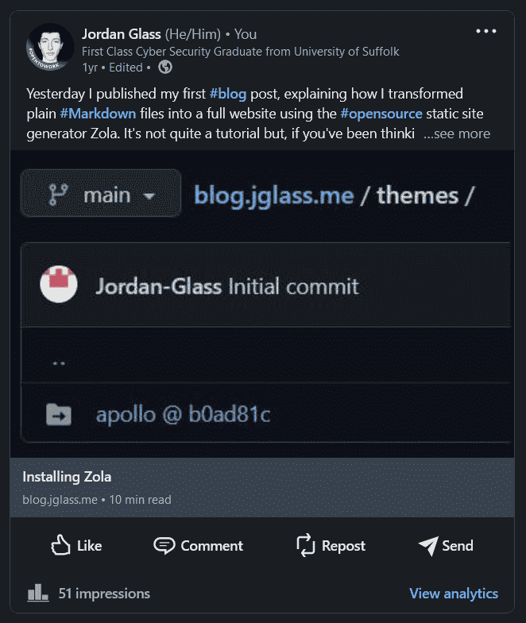
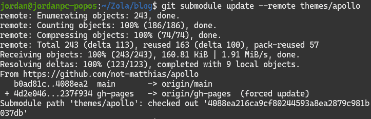
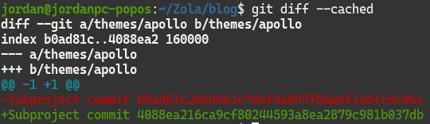
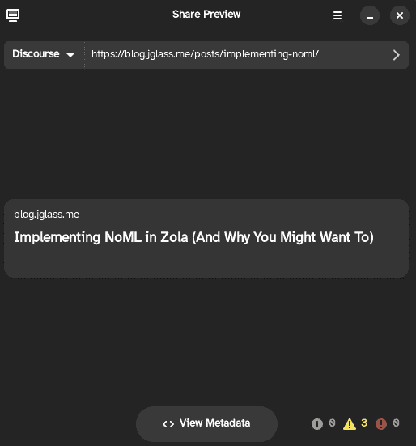
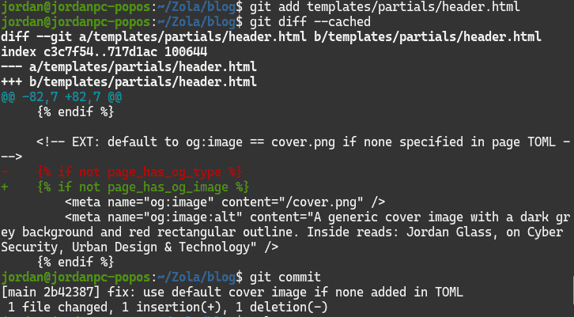
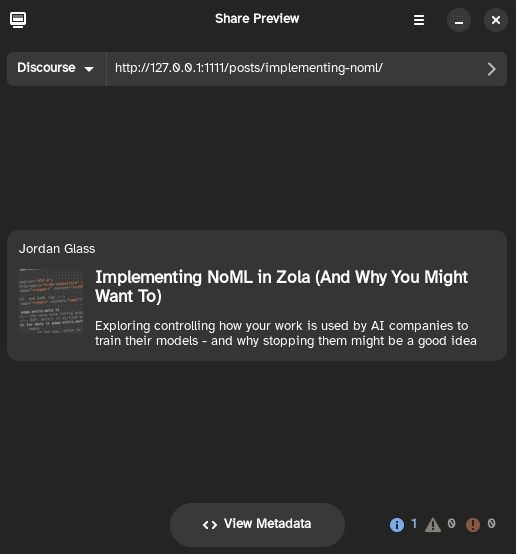

+++
title = "Implementing Media Previews with Open Graph Tags in Zola"
date = 2024-01-23T20:00:00Z
authors = ["Jordan Glass"]

[extra]
meta = [
    {property = "og:description", content = "Open Graph allows for rich media previews with images and text - like this one! Here's how I added it to my Zola site."},
    {property = "og:url", content = "https://blog.jglass.me/posts/implementing-ogp/"},
    {property = "og:image", content = "images/ogp-cover.png"},
    {property = "og:image:alt", content = "Two images divided by a red horizontal stripe. Both are media previews for a webpage, but only the bottom one has a site name, description and image."},
    {property = "og:type", content = "article"},
    {property = "og:locale", content = "en_GB"},
]
+++

The [Open Graph Protocol](https://ogp.me/), or OGP, is a series of `<meta>` tags designed to provide metadata about content hosted online, including articles, photos, and videos. It's created by Facebook, which would normally be a big red flag for me - but since it's an open standard, other sites have embraced it too, including Microsoft's LinkedIn and the decentralised Mastodon.

Platforms use OGP data to display rich information alongside webpages their users link to, including photos, bespoke headlines that differ from the page's actual title, and descriptions to elaborate on both of them.

Four tags are required as a baseline: <!-- more -->
* `og:title`, to define the title displayed in social feeds;
* `og:type`, such as `website` or `article`;
* `og:image`, to represent the content visually; and
* `og:url`, used as a permanent, fixed identifier.

It also supports many more. I'll be using:
* `og:description`, to elaborate upon the title and describe what the article is about;
* `og:image:alt`, used to describe what's in the cover image; and
* `og:locale`, to define the language the article is written in.

Platforms have to guess how to display pages that don't provide this metadata. Some do a better job than others: Mastodon uses the page's `<title>` tag and omits any images, as you'd expect, while LinkedIn uses the first `<h1>` tag and image it can find, which can be confusing since you're not meant to see them until you click through!

</img>

I want my posts to stand out a little more than that, so last month I decided to implemement Open Graph tags on this blog. Here's how I did it.

# Existing Functionality

Since I first created this blog in January 2022, the Apollo theme has received a few updates and improvements from its contributors. [One of them](https://github.com/not-matthias/apollo/pull/16) added OGP support, [automatically adding](https://github.com/not-matthias/apollo/pull/16/commits/8e790b49272ed8528b9ae6d66c677c0ca33fc0f7#diff-842f32fea346a4b69719f7b55b8b0b3aa2d86d992ea90814cd9b6234ce6d54c8) the `og:title` and `og:description` tags based on the page's `title` and `description`, defined in the [TOML](https://www.getzola.org/documentation/content/page/#front-matter), and [adding any other tags](https://github.com/not-matthias/apollo/pull/16/commits/8e790b49272ed8528b9ae6d66c677c0ca33fc0f7#diff-b335630551682c19a781afebcf4d07bf978fb1f8ac04c6bf87428ed5106870f5) explicitly defined there.

It does this by looping through the list of tags you defined and, for each one, adding a `<meta>` tag with your `key` and `value` in place of the placeholders `{{ key }}` and `{{ value }}`. If you defined a title or description, it sets a variable accordingly, and won't add another automatically.

```tera

     <!-- the meta data config goes here  -->
     
         <meta 
             
                 
                     
                 
                 
                     
                 
                 
                     
                 
                 {{ key }}="{{ value }}"
            
        />
    

```

> *The title and description tags are set automatically later in [this file](https://github.com/Jordan-Glass/blog.jglass.me/blob/main/templates/partials/header.html) if the relevant variables aren't set here with `set_global`.*

This functionality is good, but I'd like to use other tags - including the `image` and `url` ones required by the protocol. I also want to add defaults where I can, to be used if I forget to add them. So, I needed to change this functionality to suit the way I need it to work.

## Updating the Apollo theme

Before that, I had to bring my copy of the Apollo theme up to date, importing the implementation of OGP that it already provides. I downloaded the latest Apollo theme from GitHub and placed it into a new folder alongside the existing one I hadn't updated yet, to make sure that I could quickly reverse any changes if they broke anything.

I then merged the changes I had already made - in the `/templates` directory in the root of my blog folder - with the new versions of the relevant files: [`macros.html`](https://github.com/Jordan-Glass/blog.jglass.me/commit/47b487465570be8eb212a3492fb7c3d53bfc5df5), [`nav.html`](https://github.com/Jordan-Glass/blog.jglass.me/commit/3f88471bff5c9729afbb53be8d3096fe414f5fd9) and [`header.html`](https://github.com/Jordan-Glass/blog.jglass.me/commit/cd705031ff9f437fdeb6e8c89dab179bb89b1610). In the process, I made sure to add a comment next to all the changes so I could pick them out a bit more easily.

Finally, I swapped the theme the blog used to the new `apollo-new` folder, with the theme I'd just downloaded, and used `zola serve` to check how it worked.

With everything working as expected, I could pull the changes the "proper" way. Since I initially installed the theme using Git Submodules, as its [installation instructions](https://github.com/not-matthias/apollo#installation) recommended, I could simply tell Git to pull all the changes that have been made since I installed it with `git submodule update --remote`.

</img>

This downloads all the commits made to the theme that I'm missing, and updates the file that tracks the latest one I've downloaded. Here, you can see it remove the line referring to [the old commit](https://github.com/not-matthias/apollo/commit/b0ad81c2ded4e3c7defda047f8ae6f1ebfcdc96c) and replace it with a reference to [the new one](https://github.com/not-matthias/apollo/commit/4088ea216ca9cf80244593a8ea2879c981b037db).

> *Click through to either of these commits, or hover to check their URLs, and you'll see they have the same IDs as you see in the photo below! Git refers to commits uniquely using their SHA-1 checksum, which is what you're seeing here. You'll see the first few characters of these checksums in [my blog's commit history](https://github.com/Jordan-Glass/blog.jglass.me/commits/main/).*

</img>

There's a more complex way to do this, but I chose this easier one! You can see all the instructions around updating submodules [here](https://git-scm.com/book/en/v2/Git-Tools-Submodules#_pulling_in_upstream_changes_from_the_submodule_remote), and my commit updating them [here](https://github.com/Jordan-Glass/blog.jglass.me/commit/4a249ea65b42884c07bf8cb6a8b0daf0df55a4ea).

## How does it look now?

A Flatpak app called [Share Preview](https://flathub.org/apps/com.rafaelmardojai.SharePreview) allows me to simulate what my posts will look like on a social network without having to publish my work-in-progress to the Internet and check for real.

With my existing changes ported over and merged with the changes to the Apollo theme adding OGP support, the title will now work reliably - and I can now add a description if I'd like to. That's a little better than before, but I can do better.

</img>

# Making Changes

Many of the tags I wanted to implement were simply extensions of the existing functionality built-in to Apollo, but there were some more complicated elements too.

## Image & Type

Each page needs a preview image and type as part of the OGP spec. Manually setting the type as an article in each post isn't much work, but I wanted to define a generic default image in case I couldn't (or forgot to) make one for the page I'm sharing.

Since I'm no expert in professional-grade image software - and this image didn't need to be particularly elaborate anyway - I created it in PowerPoint, matching the colours and font to that of the blog itself, and [put it in the `/static` folder](https://github.com/Jordan-Glass/blog.jglass.me/commit/deaad0293acc4454029a0d0eca8d4d48cfc9ff26).

[A default `og:type`](https://github.com/Jordan-Glass/blog.jglass.me/commit/e80c00acdec6971af8d282049b726993df3b7d7c) wouldn't go amiss either: the generic `website` value is ideal for this, as pages with no type specified should be treated as if it had this tag anyway.

Both of these changes involved adding a check detecting whether another type or image had been specified in the post's TOML front matter, and adding the generic `og:type` or `og:image` tags if they were missing - very similar behaviour to the existing checks for the title and description included in Apollo.

[The default image](https://github.com/Jordan-Glass/blog.jglass.me/commit/a80ffe9e35ee6a370e1578303dd104bf304547b1) could be referenced simply with `/cover.png`, omitting the `/static` prefix. I later needed to [fix](https://github.com/Jordan-Glass/blog.jglass.me/commit/2b42387985e40ee9477e667704f365cda310a8e4) the `og:image` check, however, as I forgot to change it to use the correct variable after copying the code from the `og:type` implementation.

Like with every change, after implementing it, I used `git add` to stage the file, `git diff --cached` to review what I'd changed, and finally `git commit` once I was sure there was nothing amiss.

</img>

> *I prefer to use `git commit` without flags, unlike many tutorials. Specifically, `-m` is often mentioned, allowing you to define a comment from the shell, rather than a text editor like `nano`. I prefer the latter: it allows me to add some more text underneath the title elaborating on the change I've made, like in [this commit](https://github.com/Jordan-Glass/blog.jglass.me/commit/b307f66bb08f9bd658ffc2169b7612873ef2a6e4). Similarly, `-a` stages all changed files for commit, which breaks the one-change-per-commit rule I first learned from [Chris Titus](https://youtu.be/f7xZivqLZxc?si=xQ6N6nXXWvgiE2su&t=391) and still aim to follow now.*

## Authors & Dates

A few more of the changes are around the information you now see underneath the title on each post: the publication date, which was always there; the update date, which I added; and the article's authors, which I wanted to show alongside them.

I had already [re-formatted](https://github.com/Jordan-Glass/blog.jglass.me/commit/280ecfd0ec2a8e8069344b1bf4d48ad0692bb718) how dates are displayed in the Apollo theme, including adding the post update date alongside the publication date, [porting the changes over](https://github.com/Jordan-Glass/blog.jglass.me/commit/47b487465570be8eb212a3492fb7c3d53bfc5df5) and moving the date below the post title when I updated the theme earlier. 

Since I'm certain to define a publication date for each post, it made sense to [use them as Open Graph publication and update times too](https://github.com/Jordan-Glass/blog.jglass.me/commit/91d24ec4be71c9c60a3e63284ab237158d75b76c).

I added a check alongside the existing ones for the `og:type` and `og:image` tags so that the dates would only be added to articles: it didn't make much sense to add them to static pages I won't be changing much. I later had to [fix](https://github.com/Jordan-Glass/blog.jglass.me/commit/9f89ad2455cba7555f3e1483f5d9644e129ce90b) these tags to use the `article:` prefix instead of `og:`.

Adding authors' names under the title was a little more complex. I originally wanted to add some logic to replace instances of `default` in the authors list with the author defined in the global blog configuration, `config.toml`. This implementation would allow that name to be changed without having to change it in each individual post - reducing data redundancy, similar to how a well-normalised relational database should work. In preparation, I [added my name](https://github.com/Jordan-Glass/blog.jglass.me/commit/e1efed69423781e604a11b2c46201a6a091dd138) to that configuration file so it could be shown on any pages that needed it, and had [already added them](https://github.com/Jordan-Glass/blog.jglass.me/commit/0c61e785e43d71a501d5c31c72a9dc21c3820776) to the existing posts.

I had entirely implemented this logic when I realised that the RSS feed would now show "default" as the author, instead of my name. You can see the implementation I had to replace in this image:

</img>

[I removed the checks for any "default" authors, and simplified the logic](https://github.com/Jordan-Glass/blog.jglass.me/commit/6c154852aee6903ea5d5927a84792dbc52f4fd65). Using `for` and `if`, the logic adds a comma to separate the authors on each loop except the first, as well as `and` on the last loop - as long as it's not also the first, since reading "By and Jordan Glass" wouldn't look particularly good.

Using percentage symbols and hyphens around Tera logic allows you to control whitespace: `%-` at the start of a statement removes all whitespace before it, while `-%` at the end removes all whitespace after it. Omitting hyphens will change nothing.

I used this behaviour, together with whitespace before `and` as well as the author placeholder, to ensure that the text was spaced correctly when it appeared on the blog.

# Getting Ready

Before I take a look at the final product, there are a few miscellaneous things I had to do first.

Code to add an `og:description` tag was already present in Apollo before I made my changes, but I hadn't added a site description for it to use as a default - a problem [I've now fixed](https://github.com/Jordan-Glass/blog.jglass.me/commit/80234bd9935ae861fc00de94acc21fb37fafe1ac).

I also needed to make some changes to my existing blog posts ([1]( https://github.com/Jordan-Glass/blog.jglass.me/commit/97d7f0be7ff9d8c84e2dd693cd799037cccc9ee3), [2](https://github.com/Jordan-Glass/blog.jglass.me/commit/63fec89d9897de50d7bda2d719c98a14e7a90d1f), [3](https://github.com/Jordan-Glass/blog.jglass.me/commit/8829f92fb7f8ab3704ed1faf6390f364a4caa131)) to define the tags which aren't added automatically: specifically, the `description`, `url`, `image` and `type` tags. URL and type are easy: I know the URL the post will end up having as it's derived from the file name, and the type will always be `article`. The description takes a little more thought - I prefer it to summarise the overall point of the post, rather than introduce it. The image is the most difficult: the post might not have any images I can use already, and I wouldn't want to use them regardless. I want to use something representative of the whole post, such as [my first post's cover](https://blog.jglass.me/posts/getting-started-with-zola-part-1/markdown-cover.png), not an existing image that's reliant on the context it appears within.

I also implemented some more tags that I discovered later: specifically, [`og:site_name`](https://github.com/Jordan-Glass/blog.jglass.me/commit/f476fe02b5382d749958e1f1a983f291bf82c913) to define the name of the site, pulled directly from the configuration file - an alternative, of sorts, to the `profile` tags for authors I didn't implement; and [`og:locale`](https://github.com/Jordan-Glass/blog.jglass.me/commit/99b97bb7d54c2766da9e0945b599a4a16d4a9d2c), included in each post to define its language.

Finally, I also [better described](https://github.com/Jordan-Glass/blog.jglass.me/commit/a01340571f650cd4c598fad2b67237dbbfea4f7f) the changes I've made to Apollo - and how to spot them - in the repository's `README.md` file.

## Accessibility, Privacy & Performance

Outside of adding the OGP tags, I added `alt` tags to the [site](https://github.com/Jordan-Glass/blog.jglass.me/commit/5a60bb9cd775d2b08225f89071620dd4bce8b6ae) and [post](https://github.com/Jordan-Glass/blog.jglass.me/commit/bee3e690c8f6a3b415c484508b2f9fa3eddb4305) cover images, removed external [fonts](https://github.com/Jordan-Glass/blog.jglass.me/commit/074a4591c89661eb2804476d29a43c3ba3fc9de6) and [analytics](https://github.com/Jordan-Glass/blog.jglass.me/commit/105377ae7a9aa6e3da8e36e83c8c1ab55d9c7acb) code from the Apollo templates since I had no use for it, and ran [a couple](https://github.com/Jordan-Glass/blog.jglass.me/commit/3accffd64e95b4057d93783eb0d2cb257a3addc7) [of images](https://github.com/Jordan-Glass/blog.jglass.me/commit/d623662ea2bc90831b7a60baaba27094c1d33b70) through ImageMagick to compress them.

# In Review

With all those changes implemented and working, how will posts appear in media previews now? Share Preview has the answer:

</img>

A huge improvement!

It guarantees that the title will appear correctly, and gives me the flexibility to explicitly set a different one for previews than appears on the blog itself. It gives each post its own preview image and description to summarise what you're about to read, and puts the site name in the corner too.

I'm not doing this for clicks or views. I don't even know how many visits this blog has - it could be none for all I know - but implementing OGP has transformed it from looking like a token project I don't really care about to looking like it might actually be worth your attention, putting it on the same level as more established outlets' presence in your feeds.

A small change, and an effective one - and all using a protocol developed by Facebook. I didn't see that coming!

---

# Related on the Internet

* [Conventional Commits](https://gist.github.com/Zekfad/f51cb06ac76e2457f11c80ed705c95a3): a list of terms to prefix commit descriptions with to make it clearer what the change actually is. GitHub [automatically created](https://github.com/Jordan-Glass/blog.jglass.me/commit/f2438ebafe52eee5a9029dce6ca692fbf0b63933) a commit titled `Create zola.yml` when I was first publishing this blog to the Internet, so I assumed that a style like that was conventional - but this seems much better!
* [Using GitHub Correctly](https://christitus.com/using-github-correctly/): The text version of the video by Chris Titus that I linked above on including only one change in each commit. The `gh` utility is certainly useful, but I can't vouch for using command aliases to commit and push everything in one go. I prefer having more control than that, even if it takes longer!
* [How to Contribute to Open-Source Projects](https://www.freecodecamp.org/news/git-and-github-workflow-for-open-source/): A tutorial on forking and submitting pull requests on GitHub. I've taken a first look at this, and hopefully at some point I might be able to make some contributions somewhere.
* [Tera Documentation](https://keats.github.io/tera/docs/): Information on logic and features you can use in your Zola templates, including `for`, `if` and `length`, as well as whitespace control.

---

* [View post source](https://github.com/Jordan-Glass/blog.jglass.me/tree/main/content/posts/implementing-ogp/index.md)
