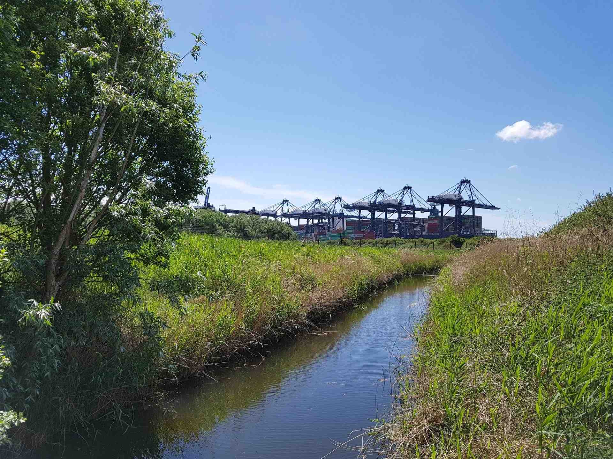
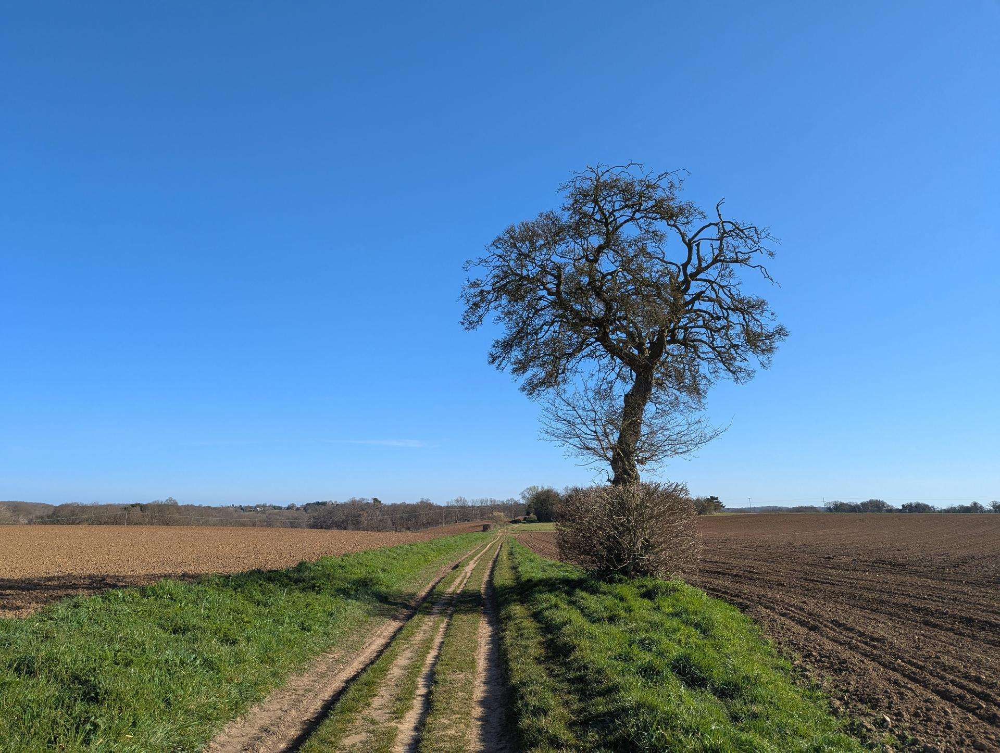
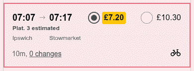
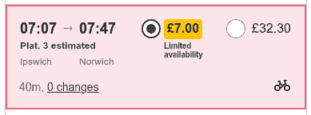
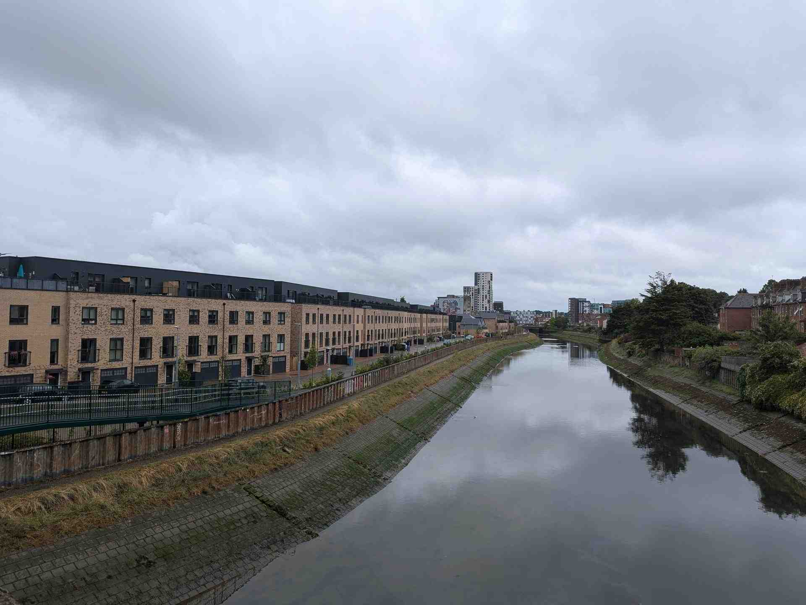
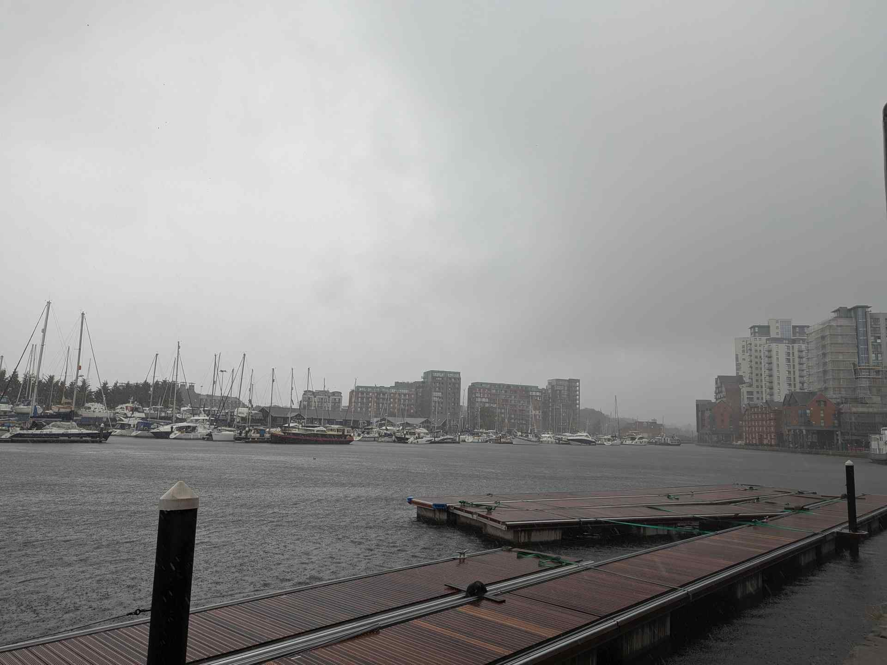
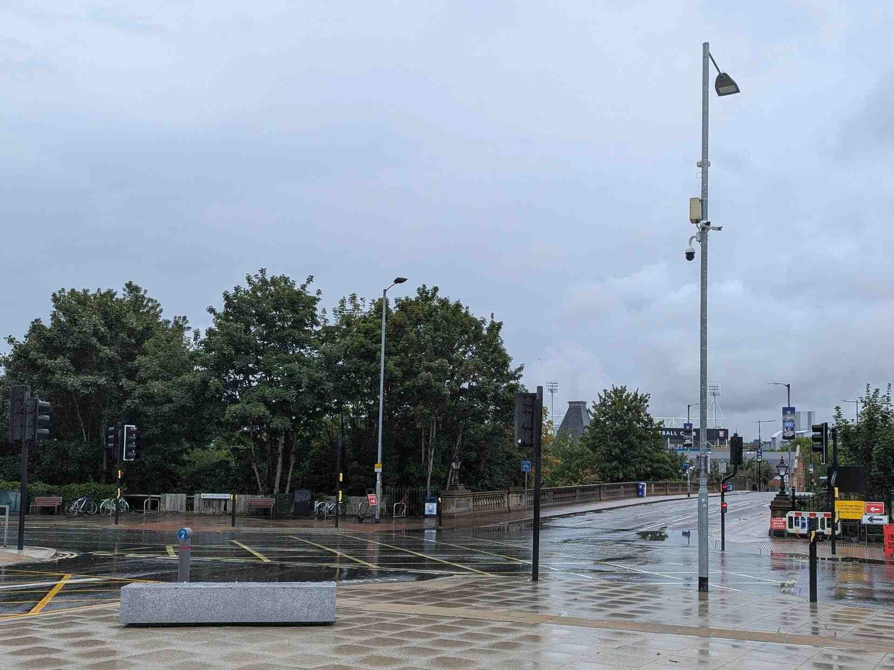

+++
title = "Does Ipswich Need A Northern Bypass? A Driver's Perspective"
date = 2025-10-12T15:34:00+01:00
authors = ["Jordan Glass"]

[taxonomies]
tags=["Urban Design"]

[extra]
meta = [
    {property = "og:description", content = "Ipswich is completely reliant on one road, but is the frontrunning solution - a new one, possibly costing billions - really the best fix?"},
    {property = "og:url", content = "https://blog.jglass.me/posts/northern-bypass/"},
    {property = "og:image", content = "images/cover.jpg"},
    {property = "og:image:alt", content = "Slightly blurry image. Centre and centre-left, a concrete bridge with multiple spans supported by concrete pillars. Atop the bridge is two two-lane carriageways surfaced in grey asphalt, with light traffic, mostly cars and vans. Above, white and grey clouds with dark grey underneath. The road descends and curves to come in front of the bridge in the foreground, where it's bordered by green trees."},
    {property = "og:type", content = "article"},
    {property = "og:locale", content = "en_GB"},
]
+++

Ipswich has a problem. It's a town of [140,000 people](https://www.ons.gov.uk/visualisations/censuspopulationchange/E07000202/) entirely reliant on one road, the A14, to move traffic around the town. This includes lorries destined for the Port of Felixstowe, the UK's [busiest port](https://maps.dft.gov.uk/maritime-statistics/index.html) (*1).

Today, these HGVs go *around* Ipswich - but before the A14 [bypassed](https://www.flickr.com/photos/ipsoc/albums/72157675631836065/with/10135078536) [it](https://www.bbc.co.uk/news/av/uk-england-suffolk-50180198) in the eighties, [the only way was straight through](https://maps.nls.uk/geo/explore/side-by-side/#zoom=12.6&lat=52.05455&lon=1.18879&layers=271&right=osm).

Perhaps this road's most defining feature, the Orwell Bridge, is also its most fallible. Its closure [sends all this traffic through Ipswich once again](https://www.gazette-news.co.uk/news/24990582.overnight-closures-set-a14-orwell-bridge-near-ipswich/#:~:text=The%20following%20diversion%20route,A14%20at%20junction%2055) - but [today](https://www.bbc.co.uk/news/uk-42182497), car ownership and usage are higher than ever.

The result: the town grinds to a halt as streets designed for local traffic are lumbered with arterial traffic too. So, what can we do?<!-- more -->

</img>

> A small part of the Port of Felixstowe.

# The Problem

The A14 links Felixstowe - and its Port - with the Midlands, meeting the A12 serving London and Suffolk's coast as it passes Ipswich.

Nothing can be resilient on its own: but, since Ipswich has no alternative route to its north, the A14 must serve local, regional and national journeys alone. It also gets congested: since it's used heavily by commuters, [traffic builds up at peak times](https://www.suffolklive.com/news/suffolk-news/a14-a12-ipswich-traffic-travel-5587724).

Despite these problems, the Orwell Bridge is still vital: its closure costs Ipswich alone [£1 million per day](https://www.bbc.co.uk/news/uk-england-suffolk-51108800), prompting calls for change. But despite being exposed to the elements, weather closed it for just [18 hours per *year*](https://www.bbc.co.uk/news/uk-england-suffolk-46309397) from 2013 to 2018.

Instead, closures for incidents add to the tally: with no alternative route, [*any* incident on the A14 around Ipswich](https://www.bbc.co.uk/news/articles/c4g490w38deo) forces drivers through it.

As does maintenance, with recent works to [replace expansion joints](https://www.bbc.co.uk/news/articles/ced23ngn41no) lasting weeks. With [60,000 vehicles](https://www.bbc.co.uk/news/articles/c5yeqy19llqo) crossing every day, the resulting tailbacks re-ignited [calls](https://www.suffolknews.co.uk/ipswich/news/more-than-1-000-people-sign-mp-s-petition-for-northern-bypas-9423336/) [for](https://www.bbc.co.uk/news/articles/crl0zg6768jo) a solution.

In 2020, a [Strategic Outline Business Case](https://web.archive.org/web/20240419154418/https://www.suffolk.gov.uk/roads-and-transport/transport-planning/consultations-and-studies/ipswich-northern-route) (SOBC) explored those solutions, flagging car dependency, pollution, business productivity and housing shortages as other issues that need addressing (p. 31-39).

Looking ahead, the bridge will not last forever, and we will need a replacement, not just an alternative, before our [hand is forced](https://youtu.be/4mn0mC0cbi8?t=626). But in the meantime: have we outgrown the A14, or grown too reliant on it?

# The Solution

Ipswich grew by just 4.7% [between 2011 and 2021](https://www.ons.gov.uk/visualisations/censuspopulationchange/E07000202/#:~:text=In%20Ipswich%2C%20the%20population%20size%20has%20increased%20by%204.7%25%2C%20from%20around%20133%2C400%20in%202011%20to%20139%2C700%20in%202021.). That's far less than the regional increase of 8.3% - and would mean, assuming steady growth, there would already have been 115,000 people living here when the Bridge was finished in 1982. Perhaps, then, we haven't outgrown the bridge.

The problem may instead be the increase in car usage. Then, four in ten households [didn't own a car](https://www.bbc.co.uk/news/uk-42182497). With higher car ownership, and changing habits meaning we use them more, we are more reliant on the bridge now than we have ever been.

The SOBC proposes a new bypass to Ipswich's north - aptly dubbed the Northern Bypass - to provide an alternative way around town. There are three potential routes (p. 62):

- The Outer Route is the cheapest and furthest away, linking Needham Market with Woodbridge via Coddenham and Grundisburgh.
- The Inner Route is the most expensive and closest option, linking Claydon with Martlesham via Rushmere.
- The Middle Route is a hybrid, linking Claydon with Woodbridge via Witnesham.

All three connect the A14 in the west with the A12 in the east, which itself meets the A14 again a few miles south. The SOBC (p. 15, 18-30, 34-39, 46) touts benefits from relieving congestion to boosting the economy; reducing pollution to facilitating housebuilding; and supporting jobs to improving sustainable transport.

> *You can find all the report's documents [here](https://web.archive.org/web/20211103015204/https://www.suffolk.gov.uk/roads-and-transport/transport-planning/consultations-and-studies/ipswich-northern-route/).*

# The Drawbacks

Perhaps the most obvious caveat is what this would cost. The bill was estimated at up to £385 million in 2019 (SOBC, p. 89-97), but inflation's been higher than the 3% accounted for (*2) - and there's the ever-present chance that costs [could increase further](https://www.ipswichstar.co.uk/news/24880162.ipswich-transport-boss-northern-bypass-project/#:~:text=Any%20Northern%20Bypass%20is%20expected%20to%20cost%20a%20significant%20amount%20of%20money%20%2D%20with%20the%20previous%20estimates%20in%20the%20region%20of%20%C2%A3500million%2C%20without%20taking%20into%20account%20compulsory%20planning%20orders%2C%20any%20unexpected%20delays%20or%20unforeseen%20costs.).

But there are more potential pitfalls than this.

Firstly, the A12 - to which the Bypass would connect - is not a free-flowing dual carriageway, but one interrupted by roundabouts, which could act as bottlenecks when the A14 is diverted along it. A separate project [doubles down](https://www.suffolk.gov.uk/council-and-democracy/consultations-petitions-and-elections/consultations/a12-major-road-network-improvements) on these roundabouts, and the SOBC (p. 50) says the Bypass project won't improve connecting roads like these.

Secondly, any Northern Bypass would be built atop unspoilt countryside, with the Middle and Inner routes flanking the [Fynn Valley](https://www.discoversuffolk.org.uk/promoted-trails/fynn-valley-path/) (SOBC, p. 62). This prompted a [campaign](https://web.archive.org/web/20191225093135/https://stopipswichnorthernbypass.co.uk/) against the Bypass, drawing [support from](https://www.eadt.co.uk/news/21427233.villages-say-no-northern-bypass/#:~:text=19%20villages%20opposing,Rushmere%20St%20Mary.) nineteen villages and an MP.

A Bypass here would bisect many [public footpaths](https://footpathmap.co.uk/map/?zoom=12.6&lng=1.18944&lat=52.10147), which are a great way to access this countryside - but how they're reconnected once the road is built varies. [Going](https://www.geograph.org.uk/photo/3858936) [over](https://maps.nls.uk/geo/explore/side-by-side/#zoom=15.2&lat=51.99533&lon=1.31512&layers=10e&right=OSLeisure) or [under](https://www.geograph.org.uk/photo/2810784) the new road is *fine* - less pleasant, but no less safe. Some, in contrast, require you to cross the road itself - and few would risk [crossing](https://www.geograph.org.uk/photo/3808430) [four lanes of 70mph traffic](https://kartaview.org/details/8844857/405/track-info) by day, let alone when it's dark.

</img>

> The Inner Route might be built here, between Rushmere and Playford.

Thirdly, and most importantly, [induced demand](https://www.wired.com/2014/06/wuwt-traffic-induced-demand/) means expanding roads encourages current non-drivers to drive, believing it to be quicker. These new drivers [fill the](https://youtube.com/shorts/eIfb7Gf136Y) [new space](https://www.youtube.com/shorts/a7g41jCoR9Y), so the traffic comes back: in short, a Bypass could leave us with the same congestion as now, hundreds of millions out of pocket.

And some of the claimed benefits have strings attached too. The SOBC says the Bypass would reduce greenhouse gas emissions (p. 7) - but any reductions [could be offset](https://doi.org/10.1016/j.trd.2012.06.008) by induced demand. It also touts time savings (p. 15), but urban mobility advocates Melissa and Chris Bruntlett [say (p. 54)](https://www.modacitylife.com/curbing-traffic) travel time could help health, happiness and social cohesion if spent outside a car: it could be productive, just not in a tangible way.

# The Lie of the Land

With all these benefits and drawbacks, the Bypass has attracted vocal support and opposition. So where is it now?

It was the *county* council who, [responsible for most highways](https://felixstowe.gov.uk/wp-content/uploads/2025/06/FTC_Mag_summer2025_web.pdf) (p. 5), commissioned the SOBC to push the project forward. At the time, Ipswich's MP - whose constituents are the most impacted by the lack of a Bypass - [supported the plans](https://www.bbc.co.uk/news/uk-england-suffolk-51282923#:~:text=Ipswich%20MP%20Tom%20Hunt%20has%20been%20in%20favour%20of%20the%20plans), while neighbouring MPs - whose constituents would be most impacted by the presence of one - [opposed them](https://www.bbc.co.uk/news/uk-england-suffolk-51282923#:~:text=Central%20Suffolk%20%26%20North%20Ipswich%27s%20Dan%20Poulter%20and%20Suffolk%20Coastal%27s%20Therese%20Coffey%2C%20have%20been%20against%20it.).

Despite [campaigning](https://www.bbc.co.uk/news/uk-england-suffolk-51108800#:~:text=Ipswich%20Central%20called,solution%5D%20is%20unforgivable.%22) from business leaders, the project was [abandoned in 2020](https://www.bbc.co.uk/news/uk-england-suffolk-51636441). It lacked the support of *district* councils, who - [responsible for planning](https://felixstowe.gov.uk/wp-content/uploads/2025/06/FTC_Mag_summer2025_web.pdf) (p. 5) - would have to commit to [15,000 new homes](https://www.bbc.co.uk/news/articles/cn7dvpr5123o#:~:text=However%2C%20in%20order,agree%20on%20housing.) to help secure government funding.

This year, however, Ipswich's new MP has [asked the Prime Minister](https://www.ipswichstar.co.uk/news/24881005.ipswich-mp-letter-sir-keir-starmer-northern-bypass/) to declare the project "nationally significant" and bypass local debates. And the county council, who [had said](https://www.bbc.co.uk/news/articles/cedgvny1qx4o#:~:text=Chris%20Chambers%2C%20cabinet%20member%20for,northern%20bypass%20in%20a%20year.) progress was on hold until next year's [mayoral elections](https://www.localgov.co.uk/Six-areas-chosen-for-devolution-fast-track/61893#:~:text=Cumbria%2C%20Cheshire%20%26%20Warrington%2C-,Norfolk%20%26%20Suffolk,-%2C%20Greater%20Essex%2C%20Sussex), has since [voted](https://www.suffolk.gov.uk/asset-library/councillor-assets/2025-07-10-votes-at-council-motion-3.pdf) to make the Bypass a priority.

Much of the debate has surrounded whether building on swathes of greenfield land is worth the benefits a Bypass would provide. But what if we asked a different question: *is the Bypass the right way to solve the problem?*

# The Alternatives

Right or wrong, we have to do *something* - but a Bypass isn't the only way. The SOBC's [Options Assessment Report](https://web.archive.org/web/20240419154418mp_/https://www.suffolk.gov.uk/asset-library/imported/appendix-a-inr-oar-addendum.pdf) (OAR) considered 26 alternatives to it, spanning a variety of different modes of transport.

It sounds counter-intuitive to look at non-road solutions to a problem with a road. The A14, of course, carries *only* cars and lorries.

But many of these alternatives could support a simple principle: [better alternatives to driving means fewer people will drive](https://youtu.be/CHZwOAIect4?t=752). That means there's fewer cars on the road that even need to use the A14 at all - and fewer people affected when it closes.

## Bus

The six bus-related options (OAR, p. 96-102) include prioritising buses at junctions, improving bus services, extending bus lanes, and building a Bus Rapid Transit (BRT) route along the Bypass' proposed route.

But, while bus lanes make sense - they can move [four times as many](https://www.theurbanist.org/2016/05/26/the-supply-and-demand-of-street-space/) people as car lanes - existing infrastructure limits where they could be built (p. 129), meaning they'd only serve buses going *into* Ipswich.

I think this stems from a desire to avoid disturbing driving infrastructure: any more space would be taken away from cars. In truth, that would be difficult to justify: [most journeys are driven](https://www.gov.uk/government/statistics/transport-statistics-great-britain-2024/transport-statistics-great-britain-2023-domestic-travel#personal-travel-in-england). Why inconvenience so many to benefit so few?

But it's a chicken-and-egg problem: investing in buses could boost usage, justifying the extra space after-the-fact. The issue is, you have to start somewhere - so how do you get enough people using buses to justify such 'anti-car' moves?

Firstly, improving journey times would help, with a journey between Needham Market and Felixstowe - roughly speaking, the problematic part of the A14 - taking [almost three times as long](https://www.google.co.uk/maps/dir/52.1556707,1.0500949/51.9669961,1.3529243/@52.0612185,1.036892,11z/data=!3m1!4b1!4m10!4m9!1m0!1m1!4e1!2m4!5e0!6e0!7e2!8j1754308800!3e3) by bus.

Secondly, infrequent service - notably, 2-hourly for [Debenham](https://www.firstbus.co.uk/sites/default/files/public/maps/116%2004-24.pdf) and just once a day for [Orford](https://www.firstbus.co.uk/sites/default/files/public/maps/70%2008-25.pdf) - means you need to plan ahead, when you can drive without a second thought. But frequency is balanced with reliability, and getting more buses to arrive on-time through [cutting services](https://www.firstbus.co.uk/norfolk-suffolk/news-and-service-updates/updates/bus-service-changes-ipswich-norwich-and-great#:~:text=REVISED%20timetables%20to,Service%20978%20withdrawn.), thereby freeing up capacity *predictably*, could [feel better](https://humantransit.org/2025/02/should-service-cuts-be-random-or-planned.html) if the alternative, amid [driver shortages](https://www.bbc.co.uk/news/uk-england-suffolk-67626334), is random cancellations.

And finally, despite [caps](https://www.gov.uk/guidance/3-national-bus-fare-cap), fares can make buses [feel more expensive than driving](https://darrellowens.substack.com/p/transit-passes-are-better-but-free#:~:text=Most%20low%2Dincome%20households%20in,way%20you%20cannot%20for%20buses.). Free fares [do](https://darrellowens.substack.com/p/transit-passes-are-better-but-free#:~:text=It%E2%80%99s%20very%20consistent%20that%20free%20fares%20does%20not%20compel%20many%20non%2Dtransit%20users%20onto%20transit%20compared%20to%20service%20improvements) [little](https://www.dw.com/en/can-public-transport-ever-replace-cars-v2/a-71943077#:~:text=%22Ridership%20has%20fallen%20dramatically%2C%20from%2042%25%20to%20now%20like%2030%25%2C%22%20Rehema%20said%2C%20adding%20that%20car%20use%20has%20gone%20up%20by%20about%205%25.%20%22People%20who%20were%20using%20public%20transport%20anyways%2C%20are%20now%20using%20it%20more%20often.%20And%20to%20some%20extent%2C%20short%20walks%20and%20bicycle%20trips%20that%20were%20taken%20before%20also%20became%20bus%20trips.%22) to attract drivers, but could [rally public support](https://darrellowens.substack.com/p/transit-passes-are-better-but-free#:~:text=Mamdani%20prefers%20to,not%20resent%20it.). But, no matter the cost, the service [must be good](https://www.dw.com/en/can-public-transport-ever-replace-cars-v2/a-71943077#video-68350722): would you rather a free bus, or one that came more often?

Here, bus stops are dense, and capped prices competitive with driving. In some places, buses come often enough too: Ravenswood is served [four times per hour](https://ipswichbuses.co.uk/wp-content/uploads/sites/44/2025/09/1_2_Leaflet_web.pdf), for example.

Extending this level of service to more neighbourhoods, matching the convenience and comfort of driving, and reversing the [decline of rural routes](https://www.theguardian.com/uk-news/2025/jun/07/almost-a-fifth-of-england-rural-bus-services-disappeared-in-last-five-years), could make buses a more attractive alternative to driving for more people.

## Train

Where the options above mainly concerned the *feeling* of public transport, these ones are more practical.

The six train-focused options aim to tempt drivers to switch (p. 101, 103-107), including a Light Rail Transit (LRT) route mirroring the BRT, improved service frequency, new train stations, and a transfer hub at Westerfield. 

Trains already feel quite pleasant to use - they're reasonably bright and comfortable - but some more improvements could remove some sticking points for drivers looking to switch.

Firstly, fares: in this example, riding from Ipswich to Norwich - a 46-mile drive - costs 20p *less* than riding to Stowmarket, a 14-mile drive.

</img> </img>

> Two results from Greater Anglia's [fare finder](https://www.buytickets.greateranglia.co.uk/book) for 1 September 2025.

A £7 ticket is rare, but when it's available, this service competes with driving on both cost *and* speed. If it were available more often, it could be an alternative to driving more often.

And, while monthly tickets and [employer discounts](https://www.careers.suffolk.gov.uk/home/benefits/travel#:~:text=Flexi%20and%20monthly%20(or%20longer)%20train%20tickets) help commuters, better [group discounts](https://www.greateranglia.co.uk/tickets-fares/discounts/groupsave) would help compete with car sharing (*3).

Secondly, timetables: stops on Suffolk's [branch](https://www.greateranglia.co.uk/media/14293/download?inline) [lines](https://www.greateranglia.co.uk/media/14287/download?inline) are served hourly. More frequent service would better fit your schedule - if there's a train always leaving when you need it to, you wouldn't need to plan when to get there. The OAR proposes improvements, but it doesn't say what 'more frequent' means.

But, like buses, this is balanced with reliability. Improving that above the current 68% ([ORR](https://dataportal.orr.gov.uk/media/1i5dwlkv/passenger-performance-jan-mar-2025.pdf), p. 5) would help people trust trains when they have to get somewhere on time.

In Suffolk, train operator Greater Anglia was already [one of the best performers in the country](https://dataportal.orr.gov.uk/media/w0bg30gk/performance-stats-release-2025-26-apr-jun.pdf) (p. 5, 8), even [winning awards](https://www.bbc.co.uk/news/articles/c237dzn70r8o#:~:text=Earlier%20in%20October,exactly%20the%20same%22.). It's now been [transferred into public ownership](https://www.bbc.co.uk/news/articles/c36kg2lzjgno) with a view to simplifying and improving services further. Nationalised services can better exist for the public benefit, rather than profit - but given how good Greater Anglia were, it's hard not to think that this risks fixing something that isn't broken.

But there's another rail-like option that could help travelling *within* Ipswich. Coventry's ["Very Light Rail" (VLR)](https://www.coventry.gov.uk/coventry-light-rail/light-rail) project aims to provide the benefits of [trams](https://www.youtube.com/watch?v=bNTg9EX7MLw) - a middle-ground of bus-like stop density, and train-like speed - at just [£10 million per kilometre](https://www.youtube.com/watch?v=jHd_e62FIf8&t=435). The Bypass' budget could build 21 miles of track, around double even the longest Outer Route.

This would help residents, commuters and tourists access the town centre without driving, potentially reducing cross-town car trips. It could get people talking about Ipswich, helping to put it on the map: it could be something that sets it apart from the crowd.

## Road

The OAR examined more road options too (p. 108-112, 119-120), including three relief roads, improvements to a junction and roundabout, and a replacement Orwell crossing that's better protected from the weather.

But these options all have flaws. The relief roads would, like the Bypass, require building on greenfield land. Tweaks to junctions won't help on a large scale.

A more sheltered bridge or tunnel must still close outright for any crashes and incidents: Ipswich would grind to a halt in many of the same scenarios as now.

A different project, a new suburban Orwell crossing [cancelled](https://www.bbc.co.uk/news/uk-england-suffolk-46948086) after costs spiralled, could never have stood in for the A14 if it were closed.

And *all* of these options fall afoul of that principle, risking encouraging more people to drive and making traffic *worse* in the long term, not better.

## Others

The final six options look wider (p. 121-126), exploring smart parking signage, integrated bus and train ticketing (like London's Oyster Card), adaptive traffic lights, real-time information on buses, a parking levy, and a congestion charge.

These could see mixed success. Parking signage could normalise driving into town, rather than using Park and Ride. A parking levy or congestion charge need improvements elsewhere first, or they'd just make getting around cost more - although the latter has been claimed to [cut pollution](https://www.bbc.co.uk/news/articles/c75q9d2pqyeo).

On the other hand, integrated ticketing would make fares more palatable, especially with a [cap](https://www.theguardian.com/uk-news/2025/mar/22/manchester-bee-network-tap-in-travel-buses-trams). Smart traffic lights could give priority to buses so they keep to schedule. Real-time information would reassure you that your bus is coming. These make public transport *better*, so reducing traffic doesn't rely on making driving worse.

# The Reality

Some of these alternatives sound great - so why won't they happen?

It comes down to status: cars [provide safety and comfort](https://www.dw.com/en/can-public-transport-ever-replace-cars-v2/a-71943077#:~:text=%22When%20people%20look,would%20help%20too.), and public transport doesn't. It could if we wanted it to: Jakarta [has got close](https://www.dw.com/en/can-public-transport-ever-replace-cars-v2/a-71943077#:~:text=2%2C200%20blue%20and%20white%20minibuses%20that%20can%20be%20caught%20within%20500%20meters%20of%20most%20places%20across%20the%20city) to replicating the door-to-door convenience of driving with minibuses, for example.

It's also habitual: we are a nation [dependent on our cars](https://media.rac.co.uk/four-in-10-say-they-have-no-alternative-but-to-drive-to-work), and we don't know how we'd go without them. This reliance frames how we view driving:

- Driving is [portrayed as integral](https://www.telegraph.co.uk/politics/2023/07/29/rishi-sunak-on-motorists-side-review-anti-car-policies/) to the way "families live their lives".
- Parking is [described as "essential"](https://e-magazine.flyeronline.co.uk/p/felixstowe-flyer/30-06-2025/a/reform-uk/6967/1954323/64057663), with increased fares [sparking panic over tourism](https://www.bbc.co.uk/news/articles/czr3r220xm1o).
- [Plans to raise fuel duty](https://www.theguardian.com/politics/2024/oct/18/fuel-duty-expected-to-rise-by-up-to-7p-per-litre-after-the-budget) [were scrapped](https://obr.uk/forecasts-in-depth/tax-by-tax-spend-by-spend/fuel-duties/#:~:text=extended%20to%202023%2D24%2C%202024%2D25%20and%202025%2D26) amid [media pressure](https://www.gbnews.com/lifestyle/cars/rachel-reeves-fuel-duty-hike-petrol-diesel-budget).
- Many opposed Wales' [reduction of urban speed limits](https://www.theguardian.com/world/2025/mar/22/wales-20mph-speed-limit-cut-road-deaths-why-debate), despite it reducing road deaths.
- *Motonormativity* drives people to [underestimate the harms of driving](https://www.bbc.co.uk/future/article/20240306-motonormativity-the-bias-that-stops-us-seeing-driving-clearly#:~:text=people%20were%20more%20likely%20to%20agree%20with%20statements%20that%20were%20critical%20of%20activities%20such%20as%20smoking%20than%20driving%2C%20though%20both%20contribute%20to%20air%20pollution%20in%20cities.).
- The media normalises incidents, with one article passively reading ["a car left the road"](https://www.ipswichstar.co.uk/news/24630208.witnesses-surprised-crash-civic-drive-ipswich/#:~:text=1.35pm%20on%20Thursday.-,A%20car%20left%20the%20road,-and%20crashed%20through) as if it's a nonevent; something to accept, but not to question.
- Road safety campaigns pin it not on drivers to see children, but [on children to be seen](https://educationservices.wakefield.gov.uk/Page/31011).

All this means doubling down on roads is the default fix for congestion, despite cars being [less efficient](https://www.fastcompany.com/3063344/these-animated-videos-show-just-how-much-space-cars-waste-in-our-cities) than the alternatives. They're used  where something else might work better, like [robotaxis](https://www.youtube.com/watch?v=040ejWnFkj0) for [concert transport](https://carfree.city/@scott/113347904393486507), and we largely ignore [the dangers they pose](https://www.sciencedirect.com/science/article/pii/S0966692324000267).

But today, many journeys *need* to be driven - which also makes improving safety harder. The AA [campaigned](https://www.theguardian.com/uk-news/2024/oct/21/aa-new-drivers-ban-passengers-graduated-driving-licence) to prevent new drivers carrying similarly-aged passengers, but without alternatives to driving, these passengers could drive their own cars instead - adding to traffic and pollution - or just stay at home, risking social isolation.

One way to redirect money from cars to their alternatives could be raising fuel duty, a levy on fuel. This would benefit those who can't, or aren't allowed to, drive, including children.

This would be controversial, however, because the improvements are a distant promise, and the costs clear to see today. But with driving costing up to [£2,000](https://www.rac.co.uk/drive/advice/learning-to-drive/how-much-does-it-cost-to-learn-to-drive/) to learn - plus maintenance, insurance, and *the car itself* - driving is already [out the reach of many](https://www.bbc.co.uk/news/uk-42182497#:~:text=The%20majority%20of,couple%20of%20decades.).

On the other hand, people limited by the location of affordable housing might have to drive despite the costs; there may be no other choice there. Since fuel duty effectively charges per mile driven, they would be worst hit by any increase.

Paradoxically, they would also benefit the most from cheaper ways to travel, with other perks including [improved](https://www.theguardian.com/uk-news/2025/jul/02/chris-whitty-culture-wars-cycling-health-nhs) [health](https://www.washingtonpost.com/climate-solutions/2025/04/12/air-pollution-paris-health-cars/) and [happiness](https://www.theguardian.com/world/2018/jun/17/why-dutch-bring-up-worlds-happiest-teenagers#:~:text=%E2%80%9CIf%20you%20look,very%20good%20boy.%E2%80%9D). However it's done, an equitable solution would pay for alternatives to driving without making getting around unaffordable, or unbearable, in the meantime.

I say all this as a driver. Better roads would make driving easier for me. But is that the best way? Better roads mean nothing for people who can't drive, be that due to costs, age or health - and anyone can find themselves in that club when they least expect it.

Cars are also associated with progress and prosperity, perhaps a holdout from the [presentation of highways as futuristic](https://en.wikipedia.org/wiki/Futurama_(New_York_World's_Fair)), and [the jobs fuelled by their construction](https://highways.dot.gov/highway-history/interstate-system/original-intent-purpose-interstate-system-1954-1956#:~:text=More%20than%209.5%20million%20persons%20%2D%20one%20of%20every%20seven%20workers%20in%20the%20United%20States%20%2D%20has%20a%20job%20directly%20connected%20with%20highways%20or%20their%20use.). In reality, cars [demand more maintenance of roads than bikes](https://web.archive.org/web/20160516133647/http://pedalfortcollins.com/greatest-demand-on-tax-dollars/) (*4), [driving is a net loss to society](https://grist.org/biking/one-mile-on-a-bike-is-a-42-economic-gain-to-society-one-mile-driving-is-a-20-loss/) - and the Netherlands and Japan, known for bikes and trains, are hardly poor.

But for now, we *need* cars: people have things to do, and driving is often the quickest - and sometimes the only - way. This means people [conflate restrictions on cars with restrictions on *them*](https://www.bbc.co.uk/news/uk-politics-66990302): in truth, they may be restrictions if the alternatives aren't there.

But what if there's another way?

# The Modern Town

Imagine a British town, and you might picture somewhere with a local shop or café - a [meeting point](https://www.youtube.com/watch?v=VvdQ381K5xg) - and perhaps a small school.

Indeed, these appear often on the screen: [David's Shop](https://emmerdale.fandom.com/wiki/David's_Shop) in *Emmerdale*, Jo Hamilton's café in *[Mr Bates vs The Post Office](https://www.itv.com/watch/mr-bates-vs-the-post-office/10a0469/10a0469a0001)*, and [Portwenn Primary School](https://docmartin.fandom.com/wiki/Portwenn_Primary_School) in *Doc Martin*, are all examples.

In Ipswich, places like [Brooke Hall and Old Kesgrave](https://www.google.co.uk/maps/search/convenience+store/@52.0541597,1.2078068,14z) look like this. Some have a row of shops, perhaps with a takeaway and a pharmacy - but many new neighbourhoods don't, perhaps because our habits have changed, and many of us drive to superstores rather than walk to corner shops. This means the option isn't there anymore for anyone who can't drive.

Apart from *what* we build is the issue of *where*, with [developments](https://www.persimmonhomes.com/new-homes/suffolk/aldhurst-view) appearing in towns far from Ipswich's employment centres. This presents an ultimatum: narrow your job search, spend [hours a day](https://www.firstbus.co.uk/sites/default/files/public/maps/64v2%2008-25.pdf) on a bus, or drive.

Of course, not all towns can support all types of job, and not all estates can sustain amenities. But now they're far away, and because there's often no practical way to get to them but to drive, "anti-car" measures are seen as inhibiting people's lives themselves.

The convenience of driving is clearer still when you need to get to several different places, such as shops in entirely different areas of the town. Your time on a bus could quickly balloon to hours, much of it spent waiting for timetables that don't quite line up.

This entrenches the car's sacrosanct position in our towns, and even our culture. In Ipswich, crossing [wide roads](https://kartaview.org/details/9305561/150/track-info) is unpleasant, and [bike lanes narrow](https://www.mapillary.com/app/?lat=52.07556316&lng=1.128206299999988&z=18.670097595608446&focus=photo&dateTo=2025-08-10&dateFrom=2025-01-01&pKey=642816965159739); and in Hounslow, houses are [set against six lanes of arterial traffic](https://maps.apple.com/look-around?coordinate=51.4797928%2C-0.3579352). [Car-themed play mats](https://www.smythstoys.com/uk/en-gb/toys/construction-and-cars/car-toys/garages/play-city-rug-play-mat/p/167876) are a feature of many childhoods, and "[drivetime](https://dictionary.cambridge.org/dictionary/english/drive-time)" a key part of radio schedules.

Another potential weakness of new estates is how they're connected to nearby places. This is Merchants Yard, and while it [will have a shop](https://www.merchantsyard.co.uk/#:~:text=ON%2DSITE%20RETAIL%0ACOMING%20SOON), and is central, it is bounded on three sides [by roads](https://www.mapillary.com/app/?lat=52.05241214000003&lng=1.149423660000025&z=17.827975078201256&focus=photo&dateTo=2025-08-10&dateFrom=2025-01-01&pKey=1075732744428797&x=0.61531752696966&y=0.45952687061706154&zoom=0).

</img>

> Merchants Yard, with Ipswich's Waterfront in the distance.

These roads don't invite you to cross them, meaning this estate risks existing as an island: near, but apart from, the places that surround it. The Bruntletts equate road crossings to oceans for children to cross; a professor calls these places an "archipelago" ([p. 14-16](https://www.modacitylife.com/curbing-traffic)).

Half a mile away, [Civic Drive](https://kartaview.org/details/9363033/466/track-info) relegates pedestrians to [underpasses](https://www.ipswichstar.co.uk/news/24740099.underpass-opens-closed-year/), forcing detours upon anyone who feels unsafe using them. It also separates Norwich Road's shops from the town centre, just 300 metres away. The two could be connected if the street put shoppers first, making Norwich Road an extension of the town centre, instead of simply existing near it.

Our car-by-default approach also [threatens children's safety outside schools](https://www.suffolknews.co.uk/lowestoft/mp-petition-calls-for-urgent-action-on-school-road-safety-9425549/), and makes [walking](https://www.nhs.uk/live-well/exercise/walking-for-health/#:~:text=Think%20of%20ways%20to%20include%20walking%20in%20your%20daily%20routine.) for exercise feel like a chore: a concerted effort. Elsewhere, [it's unremarkable](https://www.youtube.com/watch?v=KPUlgSRn6e0), pleasant, even subconscious -  because it happens not deliberately, but coincidentally, while tending to the very same tasks and errands we drive to. Even walking for leisure feels fraught, with [news of attacks](https://www.ipswichstar.co.uk/news/25031312.dog-walker-attacked-orwell-country-park-ipswich/) in our parks feeling more and more common.

Add that all together, and [one in four people do less than 30 minutes of activity per week](https://sportengland-production-files.s3.eu-west-2.amazonaws.com/s3fs-public/2025-04/ActiveLivesAdult-Nov23-24_V9-23-04-25-10-03-03-02.pdf?VersionId=aZVjaW4MK37mqMAWm_Th9un7WRjSeF7u) (p. 5) - and the divide between the least and most well off is widening (p. 13-14).

In short, we've built more, and bigger, roads; and made driving safe and desirable, [and](https://www.geograph.org.uk/photo/7487099) [walking](https://www.geograph.org.uk/photo/3970904) [not](https://www.geograph.org.uk/photo/3874238). Now, [more people are driving every year](https://roadtraffic.dft.gov.uk/summary), and we're racing back towards pre-pandemic peaks.

# The Lesson

It seems, then, that if you make driving easier, you'll get more drivers. That's bad because there's no way to break the cycle: traffic reappears, we build new roads. Rinse and repeat. Look at [Texas' Katy Freeway](https://roadstotravel.net/usa-katy-freeway/).

Except you *can* break the cycle: [traffic evaporation](https://londonlivingstreets.com/2019/07/11/evaporating-traffic-impact-of-low-traffic-neighbourhoods-on-main-roads/), the opposite of induced demand, says that traffic disappears when driving gets more difficult.

But can that be applied across a town? What if you put the alternatives to driving first from the outset?

Houten, in the Netherlands, did just that. It's a town of 50,000 built almost entirely since the eighties, designed to make active and public transport the default way of getting around.

Drivers must use the [ring road](https://livingatlas.arcgis.com/wayback/#mapCenter=5.17420%2C52.02650%2C14&active=46399) to move between neighbourhoods, but pedestrians and cyclists can go directly. This discourages driving, and makes walking and cycling quicker, safer, and more pleasant.

Urbanism advocate Jason Slaughter [explains](https://www.youtube.com/watch?v=r-TuGAHR78w) that this makes them the primary means of getting around. Vehicles are still allowed, but only to get to a *destination*: it's *through* traffic that Houten's design prohibits, making neighbourhoods quieter.

Slaughter adds that few homes face busy roads, giving children [better space to play](https://www.theatlantic.com/family/archive/2024/07/play-streets-children-adults/679258/) and [get around](https://www.youtube.com/watch?v=oHlpmxLTxpw). Melissa and Chris Bruntlett discuss this child-friendly design in [their book](https://www.modacitylife.com/curbing-traffic): Dutch cities empowered one of their children to make a 150-mile train journey alone (p. 11).

Plus, bicycle paths [act as a](https://dutchcycling.nl/knowledge/general/bridging-bicycle-promotion-and-emergency-response/#:~:text=In%20the%20Netherlands%2C%20emergency%20responders%20are%20allowed%20to%20use%20bicycle%20lanes%20in%20priority%201%20and%20priority%202%20cases%2C%20the%20categories%20with%20the%20highest%20urgency.) [priority route for](https://irishcycle.com/2022/03/12/how-cycle-paths-can-be-used-by-emergency-services/) [emergency services](https://www.leparisien.fr/paris-75/a-paris-le-delai-dintervention-des-pompiers-a-raccourci-sur-une-urgence-une-minute-ca-joue-02-03-2023-D3MEX74B4NCKHCYROAQBECNVGE.php).

The boon is that this is cheaper than you think: by upgrading streets to modern standards [when they're due for replacement anyway](https://bicycledutch.wordpress.com/2024/11/20/amsterdams-changing-streets-the-new-weesperzijde-along-the-amstel/#:~:text=The%20street%20was%20due%20for%20reconstruction.%20Roughly%20every%2030%20years%2C%20the%20pipes%20for%20water%20and%20sewage%2C%20as%20well%20as%20the%20cables%20for%20electricity%20and%20communications%2C%20of%20almost%20every%20street%20in%20the%20Netherlands%20are%20up%20for%20replacing.%20This%20presents%20an%20opportunity%20for%20the%20city%20to%20redesign%20streets.), the additional costs are little more than replacing them like-for-like - albeit the improvements now take decades, not years, a point proven even by Amsterdam's [few remaining car-centric roads](https://www.youtube.com/watch?v=hGnt5YhEu4E).

**Effectively, Houten decided it wanted fewer cars, so made using the alternatives better so the change happened naturally.** People choose not to drive because it's better not to - and it's better not to because it's designed that way.

But the Netherlands was not always a bastion of urban planning. In the sixties, Amsterdam [had plans drawn up](https://www.youtube.com/watch?v=vI5pbDFDZyI) to destroy a canal and several neighbourhoods to build more roads, seen then as a symbol of the future.

The Bruntletts say the genesis for more human-scale design came in the seventies: residents blocked a Delft street to cars, creating a safe zone for playing and socialising ([Curbing Traffic](https://www.modacitylife.com/curbing-traffic), p. 42).

That decade's *Stop the Child Murder* protests, demanding safer streets for children, [led to the development of streets](https://doi.org/10.1016/j.eist.2021.10.001) with cars slowed by design (p. '527') amid concerns over the [externalities](https://en.wikipedia.org/wiki/Externality#:~:text=The%20cost%20of%20air%20pollution%20to%20society%20is%20not%20paid%20by%20either%20the%20producers%20or%20users%20of%20motorized%20transport.) of motor traffic, garnering support across political lines (p. '528').

The movement's roots in child safety and societal costs show this isn't just a Dutch thing, or a seventies thing. So, what can we take from this?

# The Vision

Today, the UK has a housing shortage. We're [not building enough homes](https://commonslibrary.parliament.uk/research-briefings/cbp-7671/#:~:text=New%20housing%20supply%20is%20currently%20lower%20than%20the%20Government%E2%80%99s%20ambition%20of%20300%2C000%20new%20homes%20per%20year.%20Around%20233%2C000%20new%20homes%20were%20supplied%20in%202021/22.) - and we already [have 4.3 million too few](https://www.theguardian.com/politics/2025/sep/27/plan-to-build-12-new-towns-in-england-to-be-unveiled-at-labour-conference#:~:text=Academics%20say%20Britain%20faces%20a%20shortage%20of%20about%204.3m%20homes%2C%20and%20there%20are%20record%20numbers%20of%20people%20living%20in%20temporary%20accommodation.). Those we do have are unaffordable, with rent [costing 34% of income](https://www.ons.gov.uk/peoplepopulationandcommunity/housing/bulletins/privaterentalaffordabilityengland/2023#:~:text=Private%20renters%20on%20a%20median%20household%20income%20could%20expect%20to%20spend%2034.2%25%20of%20their%20income%20on%20a%20average%2Dpriced%20rented%20home%20in%20England) and [just 4% of homes under social or affordable rent schemes](https://lordslibrary.parliament.uk/housing-in-england-issues-statistics-and-commentary/#:~:text=1%20million%20were%20social%20and%20affordable%20rented%20housing).

The government have [promised](https://labour.org.uk/updates/stories/just-announced-labour-will-build-1-5-million-homes-to-save-the-dream-of-homeownership/#:~:text=The%20next%20generation%20of%20%E2%80%98new%20towns%E2%80%99%3B%20new%20communities%20with%20beautiful%20homes%2C%20green%20spaces%2C%20reliable%20transport%20links%20and%20bustling%20high%20streets) to build [twelve](https://www.theguardian.com/politics/2025/sep/27/plan-to-build-12-new-towns-in-england-to-be-unveiled-at-labour-conference) "new communities" in response, but it's important to get this right: how houses and streets are built today will leave a legacy for decades to come.

These pledges acknowledge this, [promising](https://labour.org.uk/updates/stories/just-announced-labour-will-build-1-5-million-homes-to-save-the-dream-of-homeownership/#:~:text=The%20next%20generation%20of%20%E2%80%98new%20towns%E2%80%99%3B%20new%20communities%20with%20beautiful%20homes%2C%20green%20spaces%2C%20reliable%20transport%20links%20and%20bustling%20high%20streets) green space, reliable transport, and thriving high streets. They hark back to ["New Towns"](https://www.thetimes.com/life-style/property-home/article/how-to-build-a-new-town-lessons-from-milton-keynes-zh2ncckn7), built post-War [to address housing shortages](https://www.thetimes.com/life-style/property-home/article/how-to-build-a-new-town-lessons-from-milton-keynes-zh2ncckn7/#:~:text=So%20much%20is%20different%20from%201946.%20But%20so%20much%20is%20the%20same.%20We%20are%20broke%2C%20and%20we%20need%20houses.).

Like Houten, they were small places grown to meet surging demand for housing. But while *it* was grown with sustainable transport in mind, our New Towns [tell a cautionary tale](https://web.archive.org/web/20160303220058/http://www.parliament.the-stationery-office.co.uk/pa/cm200102/cmselect/cmtlgr/603/60304.htm): they're expensive to maintain, and low density housing means driving "is a necessity" and [utilities costly](https://www.youtube.com/watch?v=7Nw6qyyrTeI).

A modern New Town, then, might put active and public transport first, and provide a mix of housing, making sure to build 'traditional' semi-detached homes too so there's something for everyone. Housing is the base of your health, family and career: feeling comfortable and settled there would help all three.

But unlike these new communities, Ipswich already exists - so how could it be reimagined?

On a smaller scale, places for cars could become places for people. Medellín [turned a car park into a green park](https://www.theguardian.com/artanddesign/2025/jul/02/parque-prado-multi-storey-car-park-garden-paradise-colombia), while Seoul turned elevated highways into [parks](https://www.independent.co.uk/travel/asia/seoul-skygarden-location-opening-seoullo-7017-south-korea-best-parks-a8346771.html), and even [a river](https://grist.org/infrastructure/2011-04-04-seoul-korea-tears-down-an-urban-highway-life-goes-on/).

But thinking bigger, we could reduce our reliance on cars - and therefore the A14 - by changing how we think about transport.

The Bypass is popular, in part, because of the impact traffic has on urban streets. [It's suggested](https://www.eadt.co.uk/news/25284789.ipswich-needs-bypass-ease-traffic-orwell-bridge/#:~:text=For%20years%2C%20Ipswich,to%20a%20bypass.) that, if there were a Bypass, traffic could be removed to it from urban streets, and the people living on them could breathe cleaner air.

Less traffic would indeed mean cleaner air, but induced demand makes building a new road a gamble: it could encourage more driving, not merely move where it happens. We could end up with more drivers, not less; worse air, not better. But what if we sought solely to reduce driving instead?

In Houten, designing for active and public transport encourages its use. Following their lead, we can turn the Bypass from a mistake driving more traffic into a solution to it instead.

Driving between neighbourhoods could be limited to roads intended to move cars: inside Ipswich, the A1214, A1156, and A1189. The Bypass would play a key role here: it and the A14 would act as an outer ring road, like Houten's but on a larger scale.

Residential streets would provide direct routes for walking, cycling, and [wheeling](https://www.sustrans.org.uk/our-blog/research/walking-for-everyone/). With less cars, they'd be safer routes that more people - including children and disabled people - would be comfortable using. They'd be quicker than driving for short distances, and help link places together - like the Waterfront, which being connected only by busy roads, feels far apart from the town centre.

These benefits could prompt some drivers to switch, making the Orwell Bridge less critical to how we get around - and the Bypass would fulfil a key goal, providing a backup for traffic destined for Felixstowe.

This would be a seismic shift in the privilege afforded to cars, and almost guaranteed to draw vocal criticism. But as the Dutch movement for safer streets united people on common ground - children's safety - this change does not have to be divisive either. It could support society's youngest and eldest - who cannot drive - and return streets to people, allowing adults to convene and children to play, [as was traditional before the car](https://www.londonmuseum.org.uk/collections/london-stories/how-street-play-shaped-lives-londons-children/).

</img>

> Ipswich's waterfront, with the University, restaurants and cafés.

Although the Netherlands started its shift five decades ago, there is a more contemporary example: Paris is [pedestrianising streets](https://www.euronews.com/green/2024/06/16/the-time-of-the-whole-car-city-is-over-how-is-paris-encouraging-walking-and-cycling#:~:text=Pedestrianising%20streets%20and%20squares), and [greening pedestrian areas](https://mastodon.world/@OWGF/115063450072149914). They've [tripled parking fees for SUVs](https://www.euronews.com/green/2024/02/05/parisians-vote-to-triple-parking-fees-for-suvs-to-curb-pollution-ahead-of-olympic-games) (*5), and [turned car parking into cycle lanes](https://www.dw.com/en/from-mumbai-to-paris-the-cities-investing-in-the-planet/a-61479857#:~:text=Paris%3A%20The%2015%2Dminute%20city). "[School streets](https://slate.com/business/2023/03/paris-car-ban-bikes-cycling-history-france.html#:~:text=the%20pavement%20is,of%20the%20street.)" give children space to play, even in city centres. [Now](https://www.euronews.com/green/2024/04/12/cycling-is-now-more-popular-than-driving-in-the-centre-of-paris-study-finds), more trips are cycled than driven, and they're hosting [an](https://www.paris.fr/evenements/from-paris-to-belem-10-years-of-global-climate-action-the-exhibition-celebrating-10-years-of-cop21-88482) [exhibition](https://momentummag.com/from-paris-to-belem-exhibition/) on how cities can help tackle climate change.

But opponents say the changes will [harm visitors](https://slate.com/business/2023/03/paris-car-ban-bikes-cycling-history-france.html#:~:text=detractors%20say%20it%E2%80%99s%20on%20track%20to%20become%20a%20toy%20city%E2%80%94hostile%20to%20people%20who%20work%20with%20their%20cars%2C%20and%20increasingly%20inaccessible%20to%20residents%20beyond%20its%20walls.) [and businesses](https://slate.com/business/2023/03/paris-car-ban-bikes-cycling-history-france.html#:~:text=businesses%20in%20car,street%20was%20pedestrianized.) - and these opponents would have some valid critiques of my idea. With the Bypass, nearby villages would still be impacted. The A12's roundabouts would still be a bottleneck. People living on the driving routes between neighbourhoods could see *more* traffic, not less. Journey times could increase. And people [who feel unsafe](https://archive.ph/jdN6x) walking at night might stay at home if they can't drive instead. Besides, we don't have a metro network like the one Parisians can fall back on.

For all those reasons, this change can't be made in isolation. So, what else would need to happen to make it work?

# The Wider Strategy

Restricting drivers without giving something back would not be well received. And rightfully so - people *need* to get around for shopping, work, and more. Most of us drive to these places today because public transport would take so much longer.

Visions to limit car usage in towns are intertwined with the "15-minute city", [the idea](https://www.bbc.co.uk/programmes/w3ct1pls) that all essential services should be within 15 minutes by foot or bike. Ipswich [announced](https://www.bbc.co.uk/news/uk-england-suffolk-56406943) its intention to become one in 2021.

But a third of people [think it's a conspiracy](https://www.theguardian.com/society/2023/jun/13/quarter-in-uk-believe-covid-was-a-hoax-poll-on-conspiracy-theories-finds), a more pressing reminder that if stemming cars is conflated with stifling freedom, public support for these changes could be lost before they've even begun.

That comparison is not just theoretical: for elderly people in particular, cars can be a lifeline - and in the absence of public transport, perhaps the only way they can get around. This means that today, conversations about more stringent health checks - and the resulting bans from driving - [are equated to limiting their freedom](https://www.bbc.co.uk/news/articles/cd0gpgjdxepo#:~:text=Sally%20Sedgman%2C%20who,people%2C%22%20she%20said.). The Houten-style neighbourhoods idea could extend that feeling to everyone, by putting up literal barriers to the movement of cars - and, by proxy, people.

Therefore, that idea can't exist in isolation. A wider strategy could draw from everything I've explored above for a more rounded solution that doesn't just impose restrictions, but gives something back too:

1. Put non-driving modes first so people who can't drive are considered from the outset, not as an afterthought.
2. Separate the car from our way of life: don't assume everyone drives, or wants to.
3. Be pragmatic: acknowledge that cars can be harmful, [some more](https://www.youtube.com/watch?v=040ejWnFkj0) [than others](https://www.lshtm.ac.uk/newsevents/news/2025/being-hit-suv-increases-likelihood-death-or-serious-injury). This could [save money](https://www.theguardian.com/environment/2025/feb/07/bradford-clean-air-zone-saves-nhs-over-30000-a-month-in-first-year), and even [lives](https://www.theguardian.com/politics/2025/aug/03/welsh-20mph-speed-limit-divisive-journey-times-deaths).
4. Support people driven out of urban areas by high rents with better rural transport links - helping them commute to work more easily.
5. Ensure driving is still reasonable - particularly for anyone who needs to, such as for emergencies, moving house, and people with disabilities that prevent them driving.

But how would these work practically?

Firstly, since cycling is [more efficient](https://theconversation.com/cycling-can-be-4-times-more-efficient-than-walking-a-biomechanics-expert-explains-why-257120) than walking, it's better for cross-town journeys. Cycle lanes separated from cars, and [priority at traffic lights to reduce stops](https://www.theguardian.com/environment/2025/sep/26/how-copenhagen-gave-cyclists-a-green-wave), would make these journeys better.

These lanes would also provide a better path for [mobility scooter users](https://bicycledutch.wordpress.com/2012/12/06/who-else-benefits-from-the-dutch-cycling-infrastructure/) than footpaths or the road.

More frequent bus and train service would better fit your schedule and replicate the get-up-and-go convenience of driving. Integrated ticketing could make fares cheaper and simpler. [Park and Ride](https://www.firstbus.co.uk/sites/default/files/public/maps/800%2008-25.pdf) could charge per *car*, not person, to attract groups and families.

Improved reliability, and real-time information - like in [Nottingham](https://www.mapillary.com/app/?pKey=1088830194943725&focus=photo&x=0.5155345495363661&y=0.6247490681580619&zoom=0.9941860465116279) and [Brisbane](https://bne.social/@james/115335853391013017) - could make them easier to trust. Smaller buses - like  [Jakarta's minibuses](https://www.dw.com/en/can-public-transport-ever-replace-cars-v2/a-71943077#:~:text=2%2C200%20blue%20and%20white%20minibuses%20that%20can%20be%20caught%20within%20500%20meters%20of%20most%20places%20across%20the%20city) - could help expand rural routes if they're cheaper to run, while [disabled access](https://stepfreelondon.uk/level-boarding-introduction/) to buses *and* trains would allow more people to use them.

Making them more comfortable [would help match the status of driving](https://www.dw.com/en/can-public-transport-ever-replace-cars-v2/a-71943077#:~:text=%22When%20people%20look,would%20help%20too.), and features like on-board Internet would help commuters. More bus lanes, and priority at traffic lights, would speed them up. These changes create reasons to choose public transport over driving *because it's better*, other than being unable to drive and having no choice.

New train stations would allow easier access to the town centre, and a VLR network could link key locations once you're there.

</img>

> Currently, only roads link the train station to key destinations.

**None of these make driving worse: rather, they make *not* driving better**. That means we can still choose whether to drive, but that more people will choose not to, so we're less hamstrung by the A14's closure.

Only when these alternatives have proven themselves as capable substitutes for driving could a congestion charge - or the Houten-style ring road idea - be considered. Even then, people who *need* to drive could get discounts or exemptions so they can still get into town.

But a vision doesn't exist on its own.

# The Bigger Picture

Next year, Suffolk and Norfolk will [elect a mayor for the first time](https://www.bbc.co.uk/news/articles/cly8wygwl9yo). This could [bring all layers of local government under one roof](https://www.gov.uk/government/collections/local-government-reorganisation-policy-and-programme-updates) - and in doing so, change the debate surrounding the Bypass.

The rural district councils, who have opposed the Bypass in the past, could be merged into a single unified authority led by a mayor which supports it.

Candidates may campaign on this, but it won't be the biggest issue on Suffolk's agenda: elections last year were [driven by national politics](https://www.bbc.co.uk/news/articles/ckg58vvej5vo). Exactly why we need a Bypass, and how we design towns, are simplified to a sensible-sounding approach: there's lots of traffic, so we need more roads. However it's done, the important thing is that the problem is fixed.

It's for that reason that most of us do what is easiest, because other demands are more important. To do what is 'right', and use public transport, would often mean longer, costlier journeys, when all that's actually important is getting to school, work, or the shops. It's quicker to drive, and we're simply using the best tool for the job.

But there is some intuitive sense of urbanism in all of us: some places feel more pleasant than others. Compare Ipswich's [pedestrianised centre](https://www.mapillary.com/app/?pKey=321804159568183&focus=photo) with Halstead's [roadside one](https://www.mapillary.com/app/?pKey=1359824514695842&focus=photo): children play, and people convene and [perform](https://www.bbc.co.uk/news/uk-england-suffolk-63173625), in the former - it's a *destination* in its own right. The latter feels less welcoming; the footpaths somewhere you'd move along, but not stay.

At the same time, few of us realise the presence, or absence, of cars contributes to this - so big-picture visions for better towns sound like fantasies. But bigger changes like these are nothing more than a sum of tiny changes.

You might not be surprised to see litter somewhere with no bins; weak passwords [with bad policies](https://www.ncsc.gov.uk/blog-post/problems-forcing-regular-password-expiry); or lots of drivers [somewhere with big roads](https://commons.wikimedia.org/w/index.php?curid=152761877). But the environment can encourage what is 'right' - having lots of bins so it's easy to bin your litter; password managers so it's easy to use strong ones; and sustainable street design so it's easy not to drive. This way, change isn't forced: it just *happens*.

Houten did the latter. Now, not driving is natural. But it's [still a free choice](https://youtu.be/r-TuGAHR78w?t=969), and the technique no secret: make doing the right thing the easiest thing, so the change is borne from pragmatism; because it's better, not through some shared love of bikes.

# The Review

So, *why do we need the Northern Bypass*?

Is it that we need a backup route if the Orwell Bridge is closed - or only that we're so reliant on cars, its closure is such a big deal?

Most of us travel by car. Thinking from that perspective, the only proper backup route would be a Northern Bypass. But people who get around by foot, cycle, bus or train don't use the bridge today: to them, a backup route could be any number of routes through Ipswich instead.

That does not apply to drivers. Diverting rush-hour car traffic through Ipswich is undoubtedly chaos. But if these drivers used one of those other modes instead, that chaos could be blunted. *If fewer people drive, there are fewer cars to divert*.

That, of course, is contingent on these alternatives being any good. As a driver, I wouldn't even consider them today: I have no incentive to. I don't hate them; it's just that I don't prefer them either, and driving is quick and easy. That said, cycling doesn't particularly appeal to me.

But it's about choice: people should be able to choose to walk, cycle, or take the bus or train, without sacrificing some combination of speed, safety, cost, and comfort compared to sitting in traffic driving. *Each person who does is one person less in the queue in front of you*. But as it stands, they are simply inferior.

Our car-first approach not only solidifies this inferiority, but also defines how we discuss the problem at hand. One businessperson [says](https://www.ipswichstar.co.uk/news/24880162.ipswich-transport-boss-northern-bypass-project/#:~:text=since%20then%20we%20have%20more%20and%20more%20cars%20on%20the%20road%20and%20people%20in%20the%20town) we need a Bypass because there are more cars and people in the town, but the two need not be connected: more people only means more cars because driving is the default, and it's the default because we've made it the best.

In doing so, we've let the Orwell Bridge become a critical link in a chain we can't afford to lose, with closure costing Ipswich £1 million per day and disrupting a key link to the Port of Felixstowe.

Amid such high stakes, we don't know what else to do but build a new road to match. We think we need it for resilience and prosperity, but the truth is: we don't know whether another way would be better.

So, if we don't know why we're building a Bypass, *do we really need it*?

You might expect a resounding "no" here, but this debate is more nuanced than that.

A new Bypass alone is not guaranteed to work. It *will* provide a better route around Ipswich when the A14 is closed - that is certain. It *will* allow some drivers who use the A14 now to use the Bypass for their commute instead.

Both are important improvements. I'm familiar with the rush-hour delays, and I've been [stuck in closures](https://www.eadt.co.uk/news/25433458.drivers-facing-long-delays-orwell-bridge-near-ipswich/).

But whether it helps solve traffic more widely is another matter. It could, in fact, hinder - thanks to induced demand - and, in any case, won't help non-drivers, including children and some disabled people.

Improving bus, train, walking and cycling infrastructure instead could give us greater resilience in other ways - but building a Bypass at the same time would complete the picture, allowing for the Houten-style approach to neighbourhoods alongside a backup for Felixstowe-bound traffic.

With all these in place, we could rethink how we move around built-up places; and with fewer cars, return streets to [the people who live there](https://www.londonmuseum.org.uk/collections/london-stories/how-street-play-shaped-lives-londons-children/), not the cars that [forced them out](https://openverse.org/search?q=no+ball+games+sign). Investment like this could inspire businesses' confidence in Suffolk, too.

Granted, deciding how to do this - and convincing people it might be better - would be an almost insurmountable challenge. It would be not a step change, but a quantum leap, in how we think about getting around. Now driving is so enmeshed with the concept of freedom, such a shift could be easily conflated with an attack on people's liberties.

And the car's position as a status symbol - or, at least, a place of comfort and refuge - must be replicated, lest drivers feel that what replaces it is worse.

But the alternative is building the Bypass by itself, and changing nothing about our approach to urban mobility. But induced demand shows us this will just give us more cars on the road. Solving this problem another way could set us up better for the future.

There are signs that a more flexible approach is coming. Councillors are [exploring pedestrianising Felixstowe's Sea Road](https://www.suffolknews.co.uk/felixstowe/car-free-road-and-resident-parking-scheme-make-up-councils-9435834/#:~:text=Further%20plans%20are,parked%20and%20moving.%20%22), which would make its independent takeaways, businesses and arcades feel part of the promenade. Currently, [they're separated by a road](https://kartaview.org/details/6172553/344/track-info). At a vote, a trial was [set for the longer term](https://www.eadt.co.uk/news/25527195.east-suffolk-presses-ahead-seafront-revamp-felixstowe/).

This is not about being ["anti-car"](https://www.eadt.co.uk/news/25284789.ipswich-needs-bypass-ease-traffic-orwell-bridge/#:~:text=And%20to%20those%20who%20might%20respond%20with%20an%20anti%2Dcar%20stance%2C%20the%20Port%20of%20Felixstowe%20cannot%20survive%20on%20bicycles.). The Port of Felixstowe, and emergency services, should not be hamstrung by the A14's closure: they need another way around Ipswich. But I also believe we need to think bigger: how do we actually take traffic off Ipswich's streets?

It's also not about saving money: with my strategy, we must still pay for the Bypass, plus the other pieces of the puzzle - like public transport - that make it work. It would, in all likelihood, be even more expensive.

But the vision is compelling: one with safe, pleasant streets, not one that ignores people who can't drive; one where we're not as reliant on the Orwell Bridge, nor as hamstrung by its closure.

One where active and public transport come first, improving health and [boosting spending at local businesses](https://content.tfl.gov.uk/town-centre-study-2011-report.pdf) (p. ii). That, in turn, could mean more money to pay for our public services and infrastructure.

One which puts quality of life first.

Of course, that is a utopia. Reality is different. Fifty years have passed since the Netherlands set out to reshape its streets. They were pioneers, and there was no guarantee their gamble would work.

But today, there's mounting evidence that putting cars first doesn't work. We have a problem which, at its core, is not about needing a backup Bypass; it's about getting people and things from A to B.

And there's no time like the present to rethink how we do that.

---

# Elsewhere on the Internet

**General**

- [Back to the Old Internet](https://laurahargreaves.com/the-old-internet/) by Laura Hargreaves: the design of this blog inspired me to start this post after months in my drafts.

**Culture**

- [I Moved Abroad For A Better Life. Here’s What I Found Disturbing During My First Trip Back To America](https://www.huffpost.com/entry/moved-abroad-came-back-to-america-culture-shock_n_67995724e4b0535cbc5f7c13) by Lauren McDonnell, HuffPost: a US expatriate describes the culture shock of returning home.

**Climate**

- [We Made a Graph](https://www.climatetown.news/p/we-made-a-graph) by Matt Nelsen and Rollie Williams, Climate Town: on climate change, energy sources, and transportation.
- [Can Our Cities Survive the Heat?](https://www.youtube.com/watch?v=qtinSxbRJV8) by Maiya May, PBS Terra: how to reduce the impact of extreme heat in urban areas.

**Urban Design & Transport**

- [These Two Cities Used To Be The Same](https://www.youtube.com/watch?v=4uqbsueNvag) by Jason Slaughter, Not Just Bikes: what makes a place designed for cars different from one designed for people?
- [10 Years Car-Free](https://podcasts.apple.com/gb/podcast/10-years-car-free-with-mrs-njb/id1678391788?i=1000641416548) and [5 Years Living In The Netherlands](https://podcasts.apple.com/gb/podcast/5-years-living-in-the-netherlands-with-mrs-njb/id1678391788?i=1000627194858): episodes of *Not Just Bikes'* podcast with his wife, discussing what international moves have meant for their family.
- [This Spanish city has been restricting cars for 24 years. Here’s what we can learn from it](https://www.fastcompany.com/90952175/this-spanish-city-has-been-restricting-cars-for-24-years-heres-what-we-can-learn-from-it) by David Zipper, Fast Company: how limiting cars eliminated road deaths and boosted the local economy.
- [Why tube strikes can improve Londoners' commutes](https://www.londoncentric.media/p/london-underground-strikes-tfl-improve-commuters) by Jim Waterson and Cormac Kehoe, London Centric: how strikes are forcing Londoners to try new commutes, making cycling impossible to ignore.
- [Cyclists Break Far Fewer Road Rules Than Motorists, Finds New Video Study](https://www.forbes.com/sites/carltonreid/2019/05/10/cyclists-break-far-fewer-road-rules-than-motorists-finds-new-video-study/) by Carlton Reid, Forbes: cyclists' transgressions are easier to spot than drivers'.
- [Bike lanes are good for business](https://www.businessinsider.com/bike-lanes-good-for-business-studies-better-streets-2024-3) by Adam Rogers, Business Insider: why business owners are wrong to oppose sustainable streets.
- [I Visited a 15 Minute City](https://www.youtube.com/watch?v=kYpe2JuZdJU) by Nic Laporte: a cycle trip to Houten.

---

# Footnotes

1. It's the busiest port by TEU, the cargo capacity unit.
3. The SOBC accounted for 3% inflation, but it's averaged 5%, peaking at 10%. *Source: average of "Infrastructure percentage change over 12 months" under "New work" in [Construction output price indices](https://www.ons.gov.uk/businessindustryandtrade/constructionindustry/datasets/interimconstructionoutputpriceindices), Feb 2020 to Dec 2024*.
4. Many group discounts are a fixed percentage, meaning each person adds to the trip cost. If they shared a car the trip would cost the same, whether one person goes or five.
5. Since cyclists wear the roads vastly less than cars, it's counter-intuitive to demand they pay tax. If tax makes cycling cost almost as much as driving, they may drive, wearing the roads more than before. On a large scale, this could be a net negative financially.
6. SUVs are [taking off](https://www.theguardian.com/uk-news/2025/aug/29/giant-cars-motoring-uk-public-safety-paris) because drivers think they're safer, with smaller cars [banned in parts of America due to their presence](https://arstechnica.com/cars/2024/08/states-keep-banning-cheap-little-kei-cars-for-fear-theyre-deathtraps/). But big cars risk harming everyone outside of them, from [drivers of smaller cars](https://www.vias.be/fr/newsroom/des-voitures-plus-lourdes-plus-hautes-et-plus-puissantes-pour-une-securite-routiere-a-deux-vitesses-/) to [children](https://www.forbes.com/sites/carltonreid/2025/06/11/eu-must-cap-suv-hood-heights-urges-report-crash-test-body-says-not-as-simple-as-that/). [Speed is a problem too](https://usa.streetsblog.org/2023/10/25/study-yes-suvs-are-deadlier-than-cars-but-on-fast-arterials-pedestrians-die-no-matter-what).
