+++
title = "Shuttle: A New Look For My Blog"
date = 2026-04-13T11:06:30+01:00
authors = ["Jordan Glass"]

[taxonomies]
tags=["Devlog"]

[extra]
meta = [
    {property = "og:description", content = "After three years, my blog's old theme was looking increasingly out of step with what I was writing on it. Here's how I changed it."},
    {property = "og:url", content = "https://blog.jglass.me/posts/shuttle-a-new-look/"},
    {property = "og:image", content = "images/cover.png"},
    {property = "og:image:alt", content = "A comparison between the theme author's new design and my reworking of it, separated by a bright green stripe running vertically. The author's version uses greys and reds, while my design uses greens."},
    {property = "og:type", content = "article"},
    {property = "og:locale", content = "en_GB"},
]
+++

Back when I started this blog, I simply wanted an outlet to prove that I could get to grips with the type of work I'd be doing in the IT sector. Being in my last year at University, the idea was that an online presence would help land me a job.

Three years on, it hasn't. This technique might, in another time, have worked among the global corporations or start-ups of Silicon Valley or London, but the job market here and now is different - and demands worked experience above almost all else.

It has, however, served as an outlet to discuss a variety of topics from [messaging apps](/posts/signal-sms/) to [propaganda](/posts/china-radio) and [bridges](/posts/northern-bypass). But while my writing has advanced in this time, the look of the blog it appeared on had not. After seeing some inspiration, I decided it was time to change that.<!-- more -->

# A Vision

Knowing little about design or development, I gave little regard to practicality with my first design - going to town in publishing software and creating a mock-up featuring a bold header with the title and post information. Looking back, it's not great - but I loved it at the time, and I was excited to get started bringing it to reality.

<center>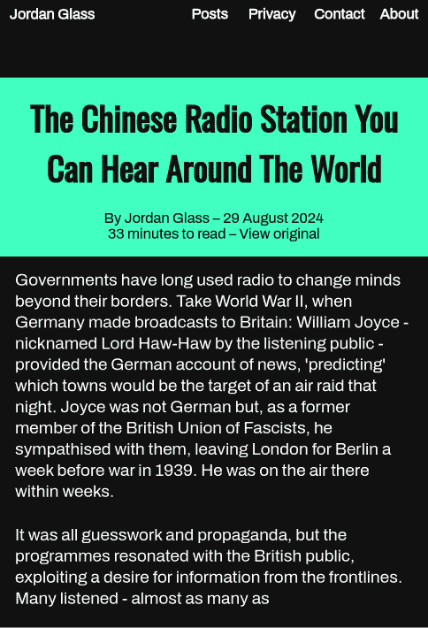</img></center>

> I wanted something more bold, but comparing this to what I ended up with, perhaps this was too far...

That lack of knowledge about development was important. I hadn't coded this blog's previous theme: pages are generated by [Zola](https://www.getzola.org/) from simple [Markdown](https://www.markdownguide.org/getting-started/) files - the same format you might use to write comments online - and the theming came from [Apollo](https://www.getzola.org/themes/apollo/), written by Austrian software engineer Matthias for his own blog. All I had to do was write the posts, and Zola and Apollo together gave me a website.

Apollo was [very basic](https://web.archive.org/web/20220928031003/https://github.com/not-matthias/apollo) back then, but that was all I needed - and the simple installation instructions made it easy to get going. I'd like to thank Matthias for sharing Apollo, and the source files for his own blog, publicly. Both served as great examples to learn from as I explored Git and Zola for the first time, and I hope I'm paying it forward by doing the same. To that end, my writing is now under a Creative Commons license as well.

<center>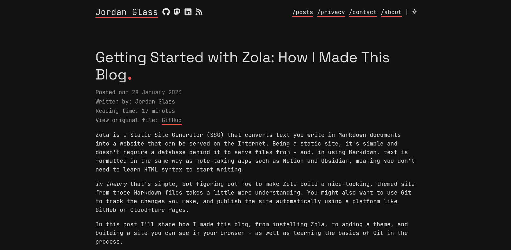</img></center>

> This blog's previous theme, almost entirely off-the-shelf besides my addition of more post information under the title.

I did change some things, such as [adding more OpenGraph tags, removing external resources](https://github.com/Jordan-Glass/blog.jglass.me/commits/main/templates/partials/header.html), and [changing how post information is displayed](https://github.com/Jordan-Glass/blog.jglass.me/commits/main/templates/macros/macros.html). But, while Apollo moved on thanks to contributions from Matthias and others, my blog was frozen in time. I'd made these tweaks by copying and modifying Apollo's templates, rather than using a Zola feature called [overrides](https://www.getzola.org/documentation/themes/extending-a-theme/#overriding-a-block) - a bodge that made it easier to get the blog working, but harder to update. This way, I had to download the new template and copy my tweaks one-by-one from the old one - a highly manual process that I'd avoided for [over two years](https://github.com/Jordan-Glass/blog.jglass.me/commit/4a249ea65b42884c07bf8cb6a8b0daf0df55a4ea) before now.

For a while, these changes were small and iterative, and I wasn't missing out on much. But in 2025, Apollo [underwent a major redesign](https://not-matthias.github.io/posts/blog-redesign-2025/), and I couldn't put it off any longer. I needed a more enduring solution.

# A Difference Of Opinion

With the radical redesign off the table, I looked into the refreshed Apollo to see if that interested me. Helpfully, Matthias' [blog post](https://not-matthias.github.io/posts/blog-redesign-2025/) discussed the reasoning behind his changes, which bought into focus just what was wrong with the older version I was using.

> ***It's been more than 3 years since I created the theme for this blog and I've grown to dislike some things about it.***
>
> Matthias

The post begins by confronting perhaps one of the most visible aspects of a simple blog like this: fonts. Apollo [previously used](https://github.com/not-matthias/apollo/tree/4088ea216ca9cf80244593a8ea2879c981b037db/static/fonts) [Jetbrains Mono](https://www.jetbrains.com/lp/mono/) for the body text, which made even small passages of text *huge*. It also used [Space Grotesk](https://floriankarsten.github.io/space-grotesk/) for the titles, a font which seemed to be nowhere one moment and everywhere the next - even appearing on [McLaren's Formula 1 cars](https://commons.wikimedia.org/wiki/File:FIA_F1_Austria_2023_Nr._4_(2).jpg#/media/File:FIA_F1_Austria_2023_Nr._4_(2).jpg) for a couple of years. Matthias' refreshed Apollo uses [Zed Text](https://www.typotheque.com/fonts/zed-text) throughout instead. 

<center>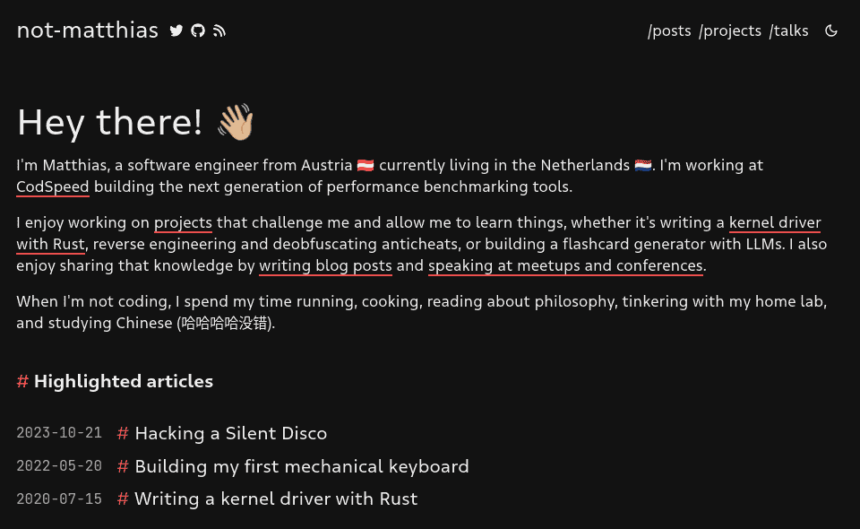</img> 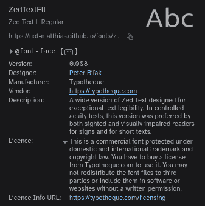</img></center>

> Matthias' new Apollo, and its new font. The license says it requires permission to use, however - and I don't know if this extends to users of the project, like me.

The changes to the homepage are significant. As Matthias [remarks](https://not-matthias.github.io/posts/blog-redesign-2025/#:~:text=Even%20when%20only%20reading%20blog%20posts%20from%20aggregators%20like%20Lobsters%20or%20HackerNews%2C%20you%20will%20likely%20end%20up%20on%20the%20front%20page%20of%20blog%20posts%20you%20enjoyed%20reading), new readers may end up there, but the old Apollo simply copied the chronological posts page. Now it's more curated, adding highlighted posts to surface old content and a short introduction about the blogger to greet new readers, with a title either [in the centre](https://github.com/not-matthias/apollo/blob/main/content/_index.md?plain=1) or [on the left](https://github.com/not-matthias/not-matthias.github.io/blob/main/content/_index.md?plain=1). Next, Matthias removed coloured underlines from navigation links - since you know these are links anyway, you don't need an underline - and removed the full stop from the end of page titles.

<center>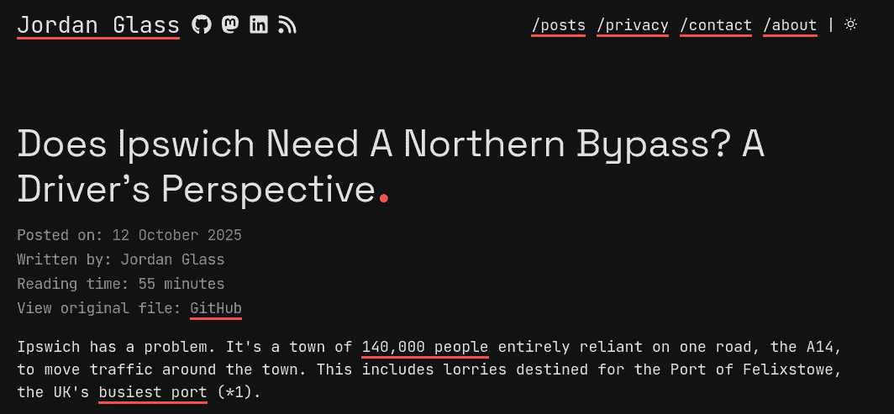</img></center>

> I was originally going to end this title with the question mark, but the trailing full stop meant it didn't look right. I used the addition productively, to frame the perspective of the post you're about to read.

A series of smaller changes follow, including rounding image corners and adding image compression. Finally, the body text was made smaller, but I find this makes it too small on mobile, and out of step with most other text media online. Matthias ends by saying he wants to add a table of contents - which has happened since this post - and a footer, which would be a great place to add links to licenses and other key pages.

All in all, it was a big step forward - but I still wanted to do my own thing in a few key places. I don't need advanced features like analytics, flowcharts and comments - to me, they add complexity I can't audit, and data protection duties from loading third-party resources I don't want. Not to mention, the fonts and colours are hardcoded, and I wanted to choose my own.

Matthias chose fonts simply by browsing other blogs, and my approach wasn't much different. I wanted to use [Oswald](https://fonts.google.com/specimen/Oswald/) for titles - a narrower font like the ones sites like [WIRED](https://www.wired.com/story/the-full-story-of-the-stunning-rsa-hack-can-finally-be-told/) use. I chose [Cascadia Code](https://fonts.google.com/specimen/Cascadia+Code) for code, which I was already using on my computer, and [Archivo](https://fonts.google.com/specimen/Archivo) for everything else, which I found while looking for a font to mimic [Android's new one](https://www.androidpolice.com/what-to-expect-android-16-qpr1/#:~:text=The%20most%20immediately%20visible%20new%20feature%20is%20Material%203%20Expressive%20%28M3E%29%20styling%20across%20Android%27s%20user%20interface). Finally, I chose this green theme because my phone chose this as an accent colour when I changed my wallpaper, and I liked it.

However, actioning all of these changes and removals using Zola extensions would be difficult, if not impossible. So, I decided to go my own way, and make Apollo my own.

# A Step Into The Unknown

The first step is to "fork" Apollo, creating my own copy to work on. This isn't making a clean break, however: I'd be retaining the ability to bring over any changes to Matthias' Apollo I like by *cherry picking* them. But that's something for the future.

Here and now, I chose a new name for the theme to minimise any confusion - something fast, to reflect the minimal nature of the theme: **Shuttle**.

<center>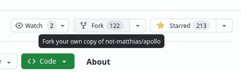</img></center>

> I use the command line to manage this site's files, but sometimes it's easier to click a button instead.

Then came the general housekeeping required with a new repository: disabling Issues, Discussions, Projects, Releases, Actions, and more. Shuttle is for me first and foremost, so I won't be needing these. Then, I downloaded a copy (clone) of the new project so I could work on it.

```bash
git clone https://github.com/Jordan-Glass/shuttle.git
```

When you manage code in Git, it's held in a repository - and each "repo" can have different branches to keep different work separate. I'll be keeping to the `main` branch for simplicity - but if I ever want to create a separate one for a more complex change, as is recommended practice, it's always an option.

<center>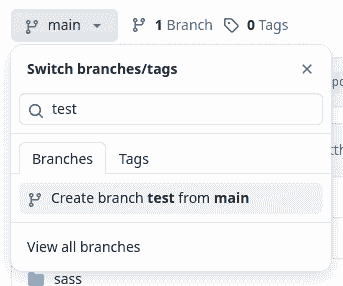</img></center>

> GitHub.com lets you easily create a new branch based on an existing one.

With these duties done I could start, first by changing the name wherever it appears. The MIT license stays, of course, since keeping it is a condition of using the code. The copyright declaration, with Matthias' name, stays too: he is an integral part of the history of Shuttle and Apollo, after all, and his work deserves credit.

<center>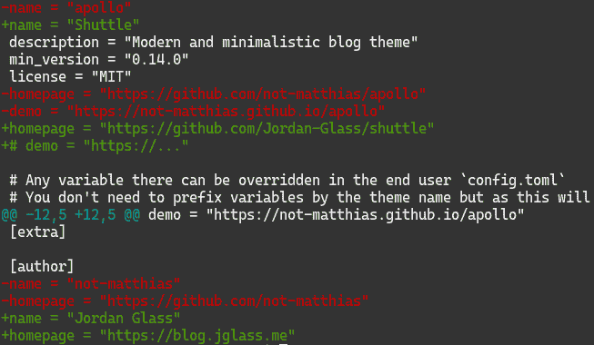</img></center>

> `git diff` shows exactly what I've changed and where, helpful to double-check what I'm publishing.

The next step was to change the theme colours and fonts. A nice effect of changing the fonts is that I can include the Open Font License text alongside them, which that license requires.

Colours were more of a challenge. Before the universal dark modes we have today, we approximated it by [inverting colours](https://9to5mac.com/2017/06/09/ios-11-dark-mode-smart-invert-colors-how-to-enable/), or brute forced it with [themes](https://play.google.com/store/apps/details?id=projekt.substratum.lite). This sidestepped designers, but system-wide dark modes demanded their full support - and doing this has taught me just how difficult that must have been. The [bright green accent colour](https://github.com/Jordan-Glass/shuttle/commit/956f5eec67cedce56b63f148b3ecc9a147a740b1) is actually darker on the light theme (`#33cc9a`) than the dark one (`#40ffc0`), to stop it blending in with the background. I had to adjust how Apollo derives other elements' colours from this accent colour, as what worked with red-on-black doesn't with green-on-dark green.

The reward for this work, however, is huge. Changing only the fonts and colours has immediately given this blog a distinct and contemporary feel, and somehow transforms what the writing feels like.

<center>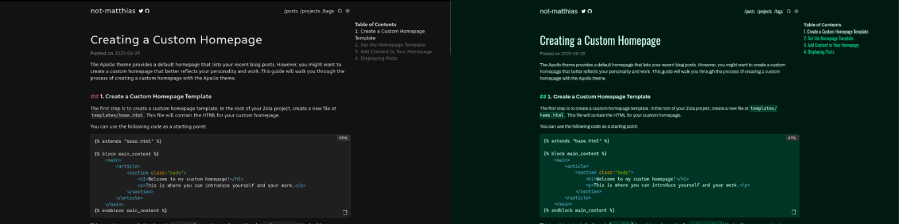</img></center>

> Changing so little goes a surprisingly long way towards realising my vision for this rework.

Next, I removed external resources like analytics and charts, and moved over features I'd added to Apollo, adding license information to posts and the homepage in the process. This got the theme to a usable baseline, which meant it was time to push my changes to GitHub - however, it failed. The [GitHub CLI](https://cli.github.com/) informed me, on running `gh auth status`, that my authentication token had expired. I simply ran `gh auth login -h github.com` to refresh it, referencing [my first blog post](/posts/getting-started-with-zola-part-1/#:~:text=login%20with%20gh%20auth%20login%2E%20It%27ll%20prompt%20you%20for%20some%20details%20and%20decisions%2E%20If%20you%20choose%20the%20SSH%20option%20you%27ll%20need%20an%20SSH%20key%20to%20authorise%20with) which helpfully told me I needed to choose the SSH option.

<center>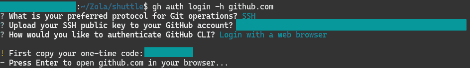</img></center>

> `gh` is GitHub's own tool, and walks you through common actions like this.

However, after this, it still wouldn't push. It asked for a password, but since GitHub [blocked password-only authentication in 2021](https://github.blog/changelog/2021-08-12-git-password-authentication-is-shutting-down/), I knew this wouldn't work. [`gh auth setup-git`](https://cli.github.com/manual/gh_auth_setup-git) fixed this, configuring `git` to use `gh` for authentication. I don't love being so tied to GitHub-specific services, even if they're not proprietary, but - like with the way I'd modified Apollo originally - it's a 'good enough' solution that just lets me get on with writing posts and updating the theme. After doing this, I could push the changes just fine.

<center>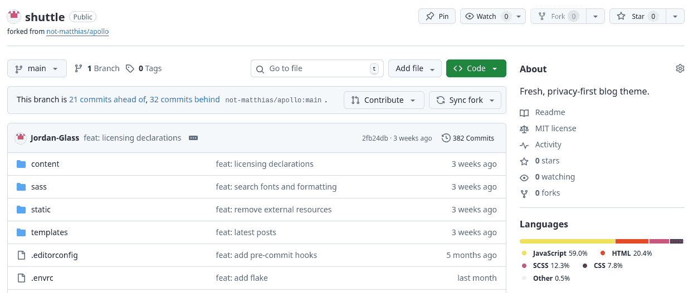</img></center>

> I always like to check my repository online to see if it's pushed correctly. There's always a nervous wait when I publish my blog's repository to see if it builds...

# A Series of Tweaks

With core functionality done, I could move on to the 'nice-to-haves' to fully utilise my new theme.

Firstly, I [added a line](https://github.com/Jordan-Glass/shuttle/commit/059a87611dcb7f4b4c9ce18e98db1b7d3622123d) to the post information under the title, allowing me to [better](https://github.com/Jordan-Glass/shuttle/commit/2fb24db756ab1a44e46fb06499461d4bcedbec31) [explain](https://github.com/Jordan-Glass/shuttle/commit/951bdfe584a4f6270c44b5a657c645abfa3fefb2) that my writing, the fonts, and the theme, are all licensed differently. I removed the leading forward slashes from the navigation bar - for example, `/posts` became `Posts`. A new favicon and [cover image](/cover.png) match the new theme, and I added configuration options for the post license declarations. With all this done, I switched my blog over to Shuttle: everything was working!

Seeing my actual blog in Shuttle's colours, not just the Shuttle sample site I'd been working with, bought into focus some more issues that needed addressing - namely, the colour of the post information and previews, and the tiny font size on mobile. Elsewhere, I allowed configuring the default cover image for social media previews, and whether the author's name is shown; and removed search functionality. I prefer to know what my blog is doing - but this feature ran to thousands of lines, making it far too complex for me to audit.

That's all great, but the adage is that software is never finished, and Shuttle is no different. While it's *done* in that it's *usable*, there'll always be things I want to tweak - and if I waited until I'd done them all to release my updated blog, you wouldn't be reading this now.

I'd like to look into accessibility a little bit more. Chrome's Lighthouse report shows good numbers, but I'd like to make more use of alternate and on-hover tags to describe elements in writing.

I'd like to put post information, like the date and author, above the contents, where it's out the way of the content. That's fine on desktop, but contents aren't visible on mobile, so it's more complex than I first thought. I'd also like to change that table of contents to use the Archivo body font instead of Oswald. A footer with copyright declarations, licenses, a link to privacy details, and information about when and how the site was built, wouldn't go amiss either.

The theme could do with some more tweaks too. Colour, in particular, remains difficult: headings in the table of contents are currently too green, quotes too grey, and post previews too vibrant. The light theme background looks great on my laptop, with its limited colour palette, but a little too green on my more capable phone. I hadn't appreciated just how difficult colour would be to get right - and the lengths professional designers must go to, to get our favourite services looking like they should.

I'd like to move some things into configuration options that are currently difficult to change, like which posts to show on the homepage. I'd like to rework the image [shortcode](https://www.getzola.org/documentation/content/shortcodes/), which Matthias uses along with an HTML class to [have images fit neatly side-by-side](https://github.com/not-matthias/not-matthias.github.io/blob/556b7f28099f662fc95e8c1dfade5474edfffba8/content/posts/blog-redesign-2025/index.md?plain=1#L48), but which currently [compresses and resizes](https://github.com/not-matthias/apollo/blob/35f4e72e76ee909516c19de2a6c4f5dc2cfae9ef/templates/shortcodes/image.html#L8) images. I compress images myself before uploading, so re-encoding them could actually make them bigger - but the formatting improvements would be nice to have.

Finally, I'd just like to take more ownership of the code - tidying it, and adding comments, so I know how it works, and how best to make all of these changes.

# A Retrospective

So, with all that said and done, am I glad to have made this update? Absolutely!

I'm happy that I write this blog. I have no idea whatsoever if anyone reads it, and don't want to know - I even blocked a reposting bot on Mastodon when I posted a link to my previous post. I don't want attention, or the hassle that comes with it: this blog simply helps me practice writing, a strength of mine I don't want to lose.

And I'm happy that I completed this upgrade. It's been several months in the making, from the initial concept last summer, to beginning work adapting Apollo in the autumn, and finalising it this spring. In fact, it was this post that held it up for quite some time, as I wanted to debut the new theme with it.

The homepage now has its own identity, explaining where you've ended up rather than simply replicating the posts page.

<center>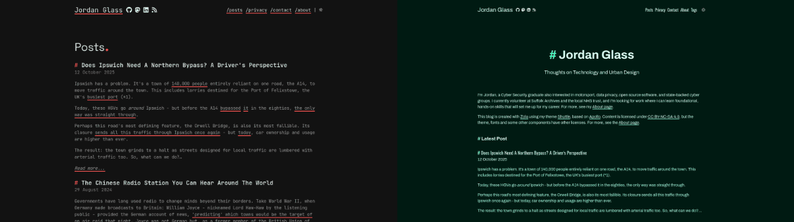</img></center>

Previously, the background colours were simply black or white. Adding a hint of green gives the site more identity.

<center>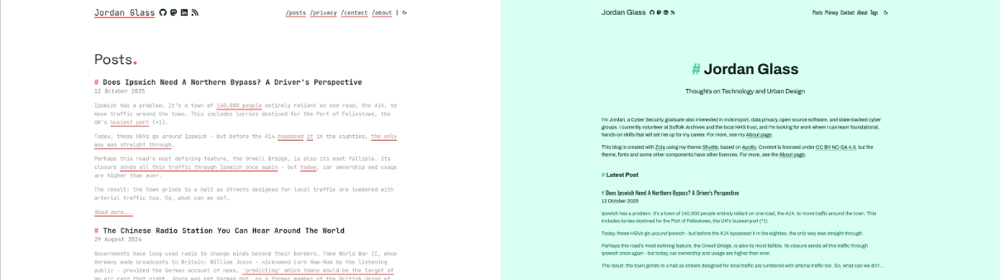</img></center>

Looking at it critically, the mobile homepage is the only slight downgrade. The title is too big, and the posts are 'below the fold', at least in my browser's developer tools. My actual phone looks better, but smaller screens may struggle - although, thanks to my font choice, the navigation now fits on one row, which is nice.

<center>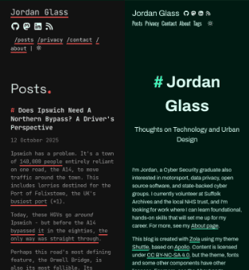</img></center>

The post page, however, is perhaps the biggest upgrade. The title font somehow elevates the writing, and the contents mean you know what you're about to read. It's a much more befitting look for writing that I'm actually quite proud of.

<center>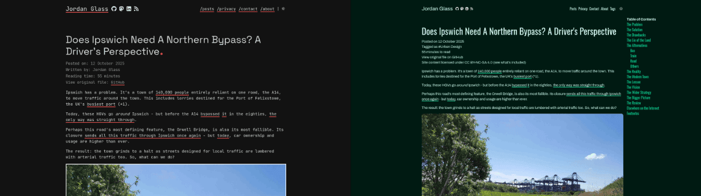</img></center>

And it's difficult to understate just how big of an improvement Archivo is over Jetbrains Mono. Jetbrains isn't bad, it's just not fit for this purpose: Archivo is much more readable, and being smaller, allows much more content to be on screen at the same time. It really shines on mobile, where it feels right at home in a more modern feeling environment. It makes the post feel more inviting, simply by dropping a font most people would associate with hackers!

<center>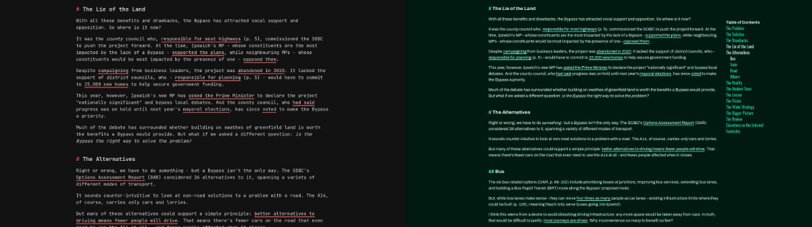</img></center>

But, all the time - and despite it taking so long - it was motivational to see the difference I was making as the theme came together. Simply changing the fonts and colours in Apollo made a huge difference, and inspired me to press on with the other, less visible aspects of the project. I hope this post has inspired you to try writing for yourself. It is a long, slow process - and without analytics or tracking, one without reward - but a valuable one nonetheless.

It takes me a very long time to complete these posts. They could conceivably pass as "done" for quite some time before I publish them - time I spend tweaking phrasing, and thinking of new comments to make. This conclusion is one such last-minute addition. But something keeps me coming back to do it.

From ideation - I have a folder full of post titles to start work on - to a finished post, re-reading and refining the whole time, I get something more valuable than a LinkedIn post. At its most basic, it's a helpful resource to refer back to when I forget how to do something specific with Git.

But at a higher level, I get a reason to truly think about technology, and articulate my thoughts on it. Not like the walled gardens of social media, I get an outlet that I *own*, not rent - a portfolio, of sorts - that proves I can. And, perhaps most importantly, I get to explore the things I care about. I hope you enjoy reading.

---

# Elsewhere on the Internet

- [Redesigning my blog](https://not-matthias.github.io/posts/blog-redesign-2025/) by Matthias: what changed in Apollo and why.
- [Zola](https://www.getzola.org/) by Vincent Prouillet: the software I use to generate this blog site.
- [zola-deploy-action](https://github.com/shalzz/zola-deploy-action/) by Shaleen Jain: the GitHub Action I use to deploy the site to GitHub Pages.
- [Apollo](https://not-matthias.github.io/apollo/) by Matthias: the previous theme for this blog, and what I forked Shuttle from. It, together with Zola, defines how my Markdown files of content get turned into nice-looking HTML pages.