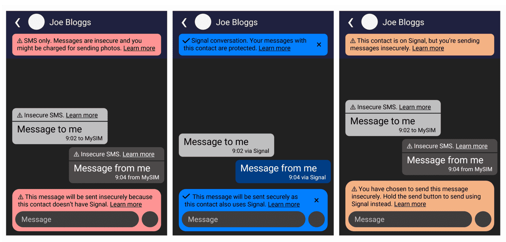

+++
title = "My Thoughts on Signal Removing SMS Support"
date = 2023-03-22T19:44:00Z
updated = 2023-03-22T21:37:00Z
+++

Over the next few days, Signal will stop supporting SMS messages on Android. After almost ten years, Signal's greatest asset for introducing the masses to secure messaging will be removed. In this post, I'll discuss why I think SMS support was so important, and why I think removing it is the wrong decision.

<!-- more -->

---

# SMS is everywhere...

In the terms of modern technology, SMS is antiquated. First used in the 1990s - when 2G was the latest in mobile communications - it has survived massive shifts in how people use their devices, from flip phones to smart phones - and the meteoric rise in social media and instant messaging they brought about.

That longevity has afforded it great ubiquity, and today almost every organisation uses it for one reason or another. From delivery notifications to appointment reminders - and, of course, ordinary conversations - SMS is everywhere.

And, because of that, SMS support was great for helping people migrate to Signal. It made it a simple, drop-in replacement for the SMS app they already had, replicating (most of) its capabilities. It ported over their existing SMS conversations, and seamlessly upgraded chats with their other Signal contacts to use end-to-end encryption. And, it did all of this without needing two separate apps on their home screen dock (or needing them to remember who uses Signal and who doesn't, because everyone was there).

You can reach almost anyone using SMS if you need to, while few people have even heard of Signal - but its capability to handle both types of message meant that lack of exposure didn't matter. It *just worked*, no matter who you needed to reach.

# ...so why remove it?

The upgrading of SMS conversations to use the Signal Protocol was so seamless you'd barely notice - but that was a caveat too. In [their blog post](https://signal.org/blog/sms-removal-android/), Signal describe that, because regular SMS messages lived alongside Signal ones, users were mistaking one for the other - thinking messages they were exchanging were private when, in reality, they were being sent in the clear over SMS, which some providers charge for.

Signal are absolutely right to say that this has "real consequences" - data being leaked, or getting billed for SMS messages you didn't think you'd sent, aren't ideal for anyone - and would be especially problematic for dissidents and activists in countries with less freedoms and rights than my own, or those on tight budgets, to name just two. But, in my opinion, their response to remove SMS support entirely, rather than attempt to improve it, risks damaging the uptake of secure messaging instead of helping it.

In fact, all three of the reasons Signal cite as justification for this decision are centred around the user experience. Besides the impact of privacy and bills on the user, Signal say that it wasn't appropriate to allow insecure SMS messages to live alongside secure ones in the same app because doing so didn't align with their values.

I can't claim to know much about software development and interface design, but as part of my studies in Cyber Security I've learnt that - deliberate, malicious actions aside - you shouldn't blame the user for something that happened by accident. For example, if someone clicks a phishing link, it might be better to ask *"what could be changed to email filtering rules, or awareness and training schemes, to make it less likely that someone else falls victim to the same scam?"*

Applying that here: you can't blame users for confusing Signal and SMS messages if they're not distinguished well enough. If they were, the risks of information leakage and unexpected bills would be reduced, and the issue of values would be moot too - because the feature is added for utility, rather than security, and it would be clear when you are and aren't sending a secure message.

# Making it clear

Currently, SMS messages are denoted only by an open padlock icon next to the time the message was sent or received, and "Insecure SMS" written in the message field - which disappears when you begin typing your message. Besides the coloured send icon, there are no other indicators that the message you're sending, or the entire conversation, are using SMS.

I think improving this communication could help reduce some of the confusion that users have been experiencing. So, shortly after the removal was announced, I spent a few minutes in PowerPoint putting together a simple concept of what more robust communication of the differences between the two might look like.

</img>

* Only the blue message denoting that you're using the Signal protocol can be dismissed - the two warnings would be permanently visible in any conversations that need them.
* Each warning has a "Learn More" link to offer users more explanation than can fit in such a small space.
* In addition to the warning messages, certain features could be restricted, such as being able to assign a colour to conversations, so that you can only use them in secure Signal chats. *(This is arbitrary: there's no technical reason to restrict functionality like this, so this might be seen by some as being user-hostile, but I see this as helping to create a stronger distinction between the two types of conversation.)*

Although these improvements are important, they don't improve the situation when using voice assistants (such as in Android Auto) to send messages, as - from my understanding - they use SMS by default, even if the contact uses Signal. Users using voice assistants to send messages wouldn't see this revised messaging in the app until they view the conversation later and see the "Insecure SMS" label. This isn't perfect, but it's at least an improvement on the current situation.

# Some more justifications

A lower-profile [support article](https://support.signal.org/hc/en-us/articles/360007321171) provides some more insight into their reasoning, and lists a few more points than the main announcement post does.

In this section I'll list these reasons and how I think they could (or couldn't) have been resolved.

## 1 & 4: UI Confusion

Like that post, this article again lists confusion between SMS and Signal messages as justification for removing SMS support. Specifically, they say that users are sending messages that they thought were private - and free, barring Internet usage charges - over SMS, leading to information being leaked to third parties and large usage charges being incurred.

As I mentioned above, these are valid concerns - but their inaction is confusing to me since it's one of the only factors they list in this article that is entirely within their control, and - given the necessary budget and resources - they could have made some changes to the user interface to make the difference between the two clearer.

## 2: Declining SMS Usage

In the second point, Signal says that SMS usage is declining, and it isn't used much at all outside of Western countries.

Perhaps its use is declining in conversations *amongst people* - but many websites still use it for multi-factor authentication, and banks, hospitals and GPs, delivery companies and many more use it for reminders and critical alerts. SMS is used this way because it's ubiqutious, and I don't see its use in this way being challenged for a long time yet - and it would be nice to continue to be able to interact with these messages from the Signal app.

## 3: SMS-based Spam Campaigns

In the UK, mobile phone numbers are [allocated in blocks](https://www.ofcom.org.uk/__data/assets/excel_doc/0028/227737/S7.xlsx) ([source](https://www.ofcom.org.uk/phones-telecoms-and-internet/information-for-industry/numbering/numbering-data)) to different service providers. I once got a spam message that - cleverly - used these allocations to customise the message, claiming to be from the network corresponding to my number. Having ported my number to another network since I first got it, this scam wasn't particularly convincing - but, needless to say, SMS-based scams are a big problem, and it is right for Signal to say that they don't have any control over them.

Signal already have a mechanism to report messages sent on its platform as spam when a new contact sends a request to start a conversation. I think this could be extended to SMS messages by prompting the user to forward the message to their country's spam reporting service, if it has one: for example, [7726](https://www.ofcom.org.uk/phones-telecoms-and-internet/advice-for-consumers/scams/7726-reporting-scam-texts-and-calls) in the UK.

While it would take time and effort to create and maintain a list of countries and corresponding spam reporting services, it would help make the reporting of SMS messages easier and would hopefully reduce the number of complaints that make it to Signal's inbox from users to mistakenly think it's their problem.

## 5: Supporting another protocol is time-consuming

Point 5 covers the amount of effort that SMS support takes Signal to maintain and keep functional on new devices, across all the different Android versions, OEMs and mobile networks. That sounds complicated, and I can see how it could distract from the development of other features that might be more helpful to Signal users.

However, a feature they have had on the roadmap for a while - but never had the resources to fully implement - are usernames. Adding this feature would be of benefit to users who don't want their account linked to a phone number at all - especially people who need to communicate securely in countries where SIM cards need to be registered with some form of ID.

However, if it's a choice between usernames and SMS support, I'd have to choose the latter. SMS support is a feature unique to Signal, and was helpful for many people getting their friends and family on-board with the concept of secure messaging. By comparison, while helpful, usernames aren't a unique feature and won't help in onboarding new users in the same way. Apps such as Telegram, Session, Briar, Element and Threema can fulfil the anonymity use-case, while Signal is more accessible to the masses.

## 6: Bugs, Delays & Errors

Point 6 covers SMS bugs, specifically instability causing long delays in sending and receiving SMS messages. This is a valid user experience concern, and one Signal can't solve - although it's not unique to Signal, and perhaps it could be helped by adding a disclaimer about this risk to the warning messaging in my example above.

That's no silver bullet because not everyone reads these warnings, but it should help in raising awareness of the problems intrinsic in SMS. I haven't seen any SMS-only app display such a message, and problems with SMS aren't a new development - so maybe people know to expect this, but simply need to be made aware that they're using that protocol and shouldn't expect the reliabilty and feature-set they're used to in instant messaging services when communicating with that contact.

## 7 & 8: Platform & Protocol Support

Points 7 and 8 cover Signal being unable to support SMS on iOS - and RCS at all - because APIs to interface with them aren't available. Of course, there's no way to work around this - but I do think the tide might be changing, at least with SMS.

Anti-trust and market competition investigations are ongoing around the world - particularly with regards to Apple, who might be forced to allow competing app stores and browser engines on iOS for the first time. Depending on the wording of the judgements arising from these investigations, or any settlements they make, they might be forced to allow third-party apps like Signal access to SMS messages as well.

I can see how Signal only supporting SMS on Android, rather than across all its mobile platforms, would confuse users. A regulatory decision enforcing SMS support for third-party apps on iOS would be a significant step towards levelling the playing field across Android and iOS. Although the tablet and desktop clients still wouldn't support it, the distinction between them and phones in general is much more intuitive to the average user than the difference between Android and iOS - and the broad advice would become, *if your phone can send SMS messages, Signal can too*.

RCS is much more complicated, both in its implementation and the path towards APIs for it being made available. Google currently gatekeeps both on Android - it is their choice not to make APIs available, and it is them who runs the infrastructure powering the feature in the default Messages application (under a feature previously called "Chat"). And, of course, supporting it on iOS requires Apple supporting it *at all*, which could risk the dominant position of iMessage.

Arol Wright from Android Police [comments that](https://www.androidpolice.com/signal-removes-sms-support/) RCS could be a solution to the change Signal are making because everyone should just be avoiding using SMS at this point anyway - and that, by using Google Messages, "chances are" that your messages will be sent over the "actually secure" RCS. But the fragmented nature of the RCS ecosystem, the inconsistent nature of its security, and its reliance on Google and mobile networks to function, mean that I don't see it as a replacement for SMS at this point - and it's certainly no match for Signal.

The point Signal makes is fair, however - despite its drawbacks, RCS is becoming increasingly popular among personal communications, and I just don't see APIs being made available for it any time soon.

# What now?

I don't want this post to come across as unnecessarily critical: Signal is an easy-to-use app that makes encrypted communications accessible to anyone, and - despite this change to SMS support - that still stands.

But that change also leaves me wondering: *where does this leave Signal?* Sure, it's more trustworthy than WhatsApp, more secure than Telegram, and more accessible than Threema (by virtue of being free) - and it's definitely better than plain SMS - but, as much as us privacy and security enthusiasts understand the importance of encryption and open source, regular users don't, and they don't know why they should demand more accountability from the operators of the services they use.

That was why seamless SMS support was so important. You can't convince an average user of WhatsApp that Signal is more trustworthy because they're a non-profit, and not in the business of mining your data. *They already use Facebook*, and have no tangible reason to distrust them - despite the catalogue of scandals they've been involved in, you can't see your data like you can your physical possessions, and Meta's abuse of it happens in the shadows - invisibly, and far away.

By bringing encrypted communications to an SMS app, Signal put privacy in the hands of people who don't want to deal with yet another app just to communicate with the one privacy advocate they know. Signal replaced the SMS app they already used, and likely had many of the same features as it - and that was a much easier sell.

In seamlessly upgrading conversations to use encryption where possible, it made improving the privacy of your conversations with other Signal contacts almost effortless, and allowed enthusiasts like me to tell someone, *"this app is like the one you use already, but it makes your conversation with me better"* - no extra apps or learning curve required - and many Signal users sold it to their family and friends on that premise.

What of families that migrated their chats to Signal when WhatsApp [changed their privacy policy](https://www.theguardian.com/technology/2021/jan/24/whatsapp-loses-millions-of-users-after-terms-update) back in 2021? Many of them likely still use WhatsApp and Facebook Messenger for everyone else they know. Do they keep Signal just for that privacy enthusiast that recommended it to them? That same enthusiast that might now have to help them get their old SMS apps back?

For me, nothing changes. I'll keep using Signal, as will everyone I message using it - just with a bit less convenience than before. But now, that selling point on which many of these millions of users switched in 2021 is gone: Signal can no longer be the one do-it-all app it once was. SMS is by no means perfect, but it was a compromise: a way to meet ordinary users in the middle and ease their transition from SMS to encrypted messaging.

In putting up walls around its service, Signal risks becoming just another app that privacy advocates use to talk to each other. To them - and to Signal - its flagship feature is encryption, to which nothing is changing, but about which the masses don't care. To regular users, in losing SMS support, it is losing its trump card: to them, it becomes just another WhatsApp or Telegram imitator. Stories, stickers, and all. And, given what Signal had managed to do, that's a great shame.

---

Update, 22 March @ 21:37:

* *Since publication, this post was updated to reflect that SMS support will be retired as part of a gradual rollout - the exact dates for which vary "by individual usage" - rather than on the same day for everyone, based on a post [here](https://www.reddit.com/r/signal/comments/113uk8m/comment/j8y1cqb/?context=1) by a Signal developer.*
* *I vaguely remember the Signal app telling me it would happen on for me 23 March, but there seems to be no official communication on Signal's blog post or support article on what the earliest and latest possible dates could be.*
* *If you're a Signal user, you might already have lost SMS support, or the change might be yet to happen. Regardless, it's still going ahead, so the points I make in the rest of this post remain unchanged.*

---

* [Archived version of the Signal support article](https://archive.ph/ny0jF) *(note: server [may be located in Russia](https://iplookup.flagfox.net/?ip=188.143.233.210&host=archive.ph))*

---

* [View post source](https://github.com/Jordan-Glass/blog.jglass.me/tree/main/content/posts/signal-sms/index.md)
